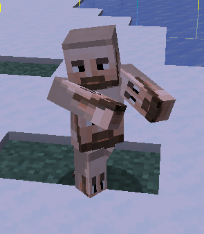

# 🗿 3.3 vs 3.2


### IA 3.3 Is is in beta (As of 26.11.2022)

<mark style="color:red;">DO NOT USE IT ON PRODUCTION SERVERS!!</mark>


## Introduction

ItemsAdder 3.3 introduced a new way to organize your resources:



## Which was the issue with the 3.2 folder structure?

Removing, recognizing, and merging resource packs was extremely difficult and made a lot of artists mad. The new structure makes organizational tasks extremely fast and easy to do.

You can simply delete one folder and have a complete set of features removed without having to manually search and delete files around.

You can now also easily merge other resource packs into ItemsAdder without having to manually edit files, just drag and drop!

## Frequently asked questions

### Are old 3.2 packs compatible?

Yes, you can just continue using the old structure (items\_packs and resource\_pack).\
ItemsAdder will still load your assets from these folders if still available.

## The old structure (click to zoom)

Example with two packs: `my_items` and `another_pack`.

<figure><figcaption></figcaption></figure>

## The new structure (click to zoom)

Example with two packs: `my_items` and `another_pack`.

<figure><figcaption></figcaption></figure>

### `contents` folder

This folder contains all your packs.\
You can create as many packs as you want to organize your work.\
This is useful when you get packs from other websites and if you want to easily remove-add packs with just a click.

#### `configs` folder

This folder contains all the `.yml` configurations for your items, GUIs, blocks, loots, etc.

#### `resourcepack` folder

This folder contains some sub-folders, each one is called a <mark style="color:purple;">**namespace**</mark>.\
In the first example, you can see a single folder for your namespace, called `my_items`.

Each <mark style="color:purple;">**namespace**</mark> folder contains all the graphical assets for your pack: textures, models, sounds, and shaders.

## Merge resource packs order (step 4):


[merge-resourcepacks](plugin-usage/merge-resourcepacks/)

