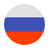

# 👋 Welcome

## 🌐Socials

* [Patreon](http://patreon.com/lonedev)
* [Ko-fi](http://a.devs.beer/kofi)
* [YouTube](http://youtube.com/lonedev)
* [SpigotMC](https://www.spigotmc.org/members/lonedev.88296/#resources)
* [Website](https://www.matteodev.it/)
* [Steam developer page](https://store.steampowered.com/developer/LoneDev/)
* [Discord](https://discord.gg/4dfnpUK)

## 📖 About IteamsAdder

ItemsAdder is a plugin for Bukkit servers (Spigot, Paper, Purpur, Tuinity, Airplane, SpongeVanilla, Pufferfish).\
ItemsAdder or IA for Short is the best Minecraft customizer.\
The limit is only your imagination! you can add whatever your ❤️ desires\
In IA you can create mobs, entities, emojis, items, and much more...\
I'm adding features and improving the plugin on a daily basis!\
Also thanks to the huge [community](https://discord.gg/4dfnpUK) around IA we have over 100+ [add-ons](https://addons.devs.beer/itemsadder/) for your server to give you more than 5000+ new things!\
The best thing about IA is the optimization! You wouldn't notice it running.\
With the growing [compatibility list](https://itemsadder.devs.beer/compatibility-with-other-plugins/compatible), more and more plugins are supporting IA which only benefits you and your server.\
This is just the beginning because the sky is the limit when your server is using ItemsAdder

## 🗺️ Read It In Your Language

The IA wiki is available in your language also, thanks to the amazing community.\
   

## 📚 Legal Info

EULA For Creating Items\
License\
TOS\
Discord Support TOS\
Copyright
