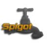

# 👋 Welcome To The  Wiki

### 💠Quick Links


[first-install.md](first-install.md)



[adding-content](plugin-usage/adding-content/)


<h3>🌐Social Media</h3>
<!-- Contact Me -->

    
    
    <a href="http://youtube.com/lonedev">
    
    
    
    
    

### 📚Legal Info

* [Support Team Policy](legal/support-team-policy.md)
* [Addons Creation Policy](legal/addon-creation-policy.md)
* [Plugin TOS](legal/tos.md)
