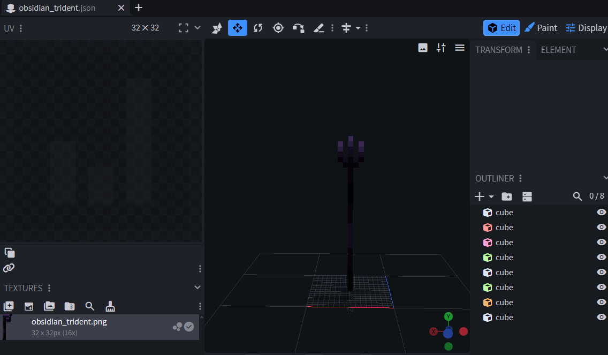
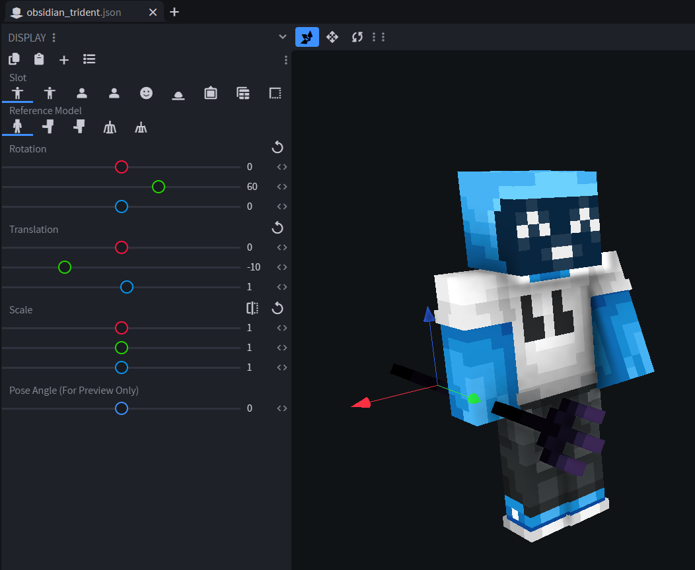
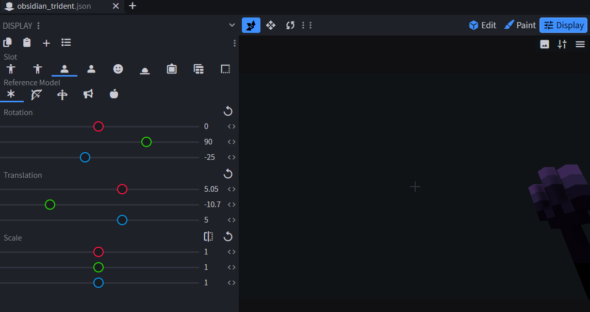
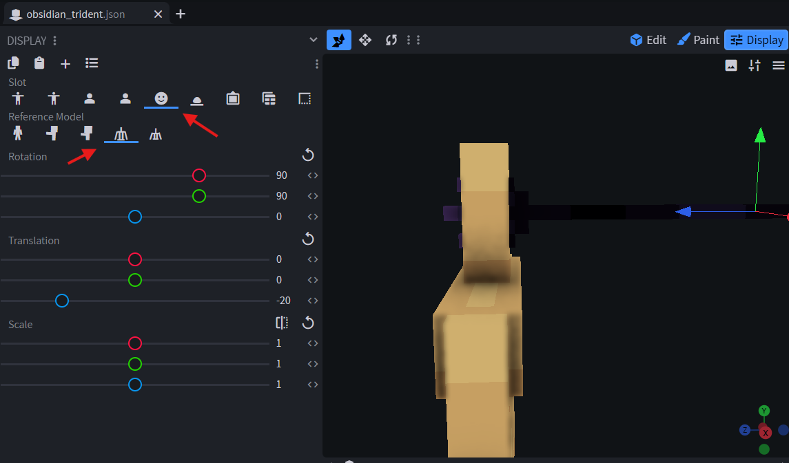

# 🔱 Tridents


Available since ItemsAdder 4.0.11.

Requires Minecraft 1.21.4+ clients. Server version is not important.


## Example model `obsidian_trident`

```yaml
info:
  namespace: test
items:
  obsidian_trident:
    name: Obsidian Trident
    resource:
      generate: false
      model_path: item/obsidian_trident
      material: TRIDENT
      icon: item/obsidian_trident
```

### Creating the trident

Create a json file in `contents/test/models/item/obsidian_trident.json`\
Or create a model inside of blockbench like usual:
<figure><figcaption></figcaption></figure>

#### Set the item held locations

<figure><figcaption></figcaption></figure>

<figure><figcaption></figcaption></figure>

#### Set the hit model location

<figure><figcaption></figcaption></figure>

Here is the complete display:

```json
	"display": {
		"thirdperson_righthand": {
			"rotation": [0, 60, 0],
			"translation": [0, -10, 1]
		},
		"thirdperson_lefthand": {
			"rotation": [0, 60, 0],
			"translation": [0, -8, 1]
		},
		"firstperson_righthand": {
			"rotation": [0, 90, -25],
			"translation": [5.05, -10.7, 5]
		},
		"firstperson_lefthand": {
			"rotation": [0, 90, -25],
			"translation": [6.25, -11, 3.5]
		},
		"head": {
			"rotation": [90, 90, 0],
			"translation": [0, 0, -20]
		}
	}
```

### Create the throwing model (`_throwing.json` model)

This is the model shown when you are holding the right click button.\
Create a json file in `contents/test/models/item/obsidian_trident_throwing.json`

It's the same model as before, the only difference is the rotation when hold in hand.

You can create a totally different model using Blockbench or simply create a copy of `obsidian_trident.json` and change the rotation like that:

```
{
	"parent": "test:item/obsidian_trident",
	"display": {
		"thirdperson_righthand": {
			"rotation": [0, 90, -180],
			"translation": [0, 11, 1]
		}
	}
}
```

NOTE: Minecraft automatically applies some hardcoded rotations and translations to the firstperson view of the throwing model.\
You should not edit the firstperson view, only edit the thirdperson. The game will apply some rotations and translations accordingly.

## Inventory 2D icon

You can set a 2D icon in inventory.


[2d-icon.md](item-properties/2d-icon.md)


## Done



## Example pack

[Example pack](https://github.com/bruhhhwarrior/tridents/releases)


