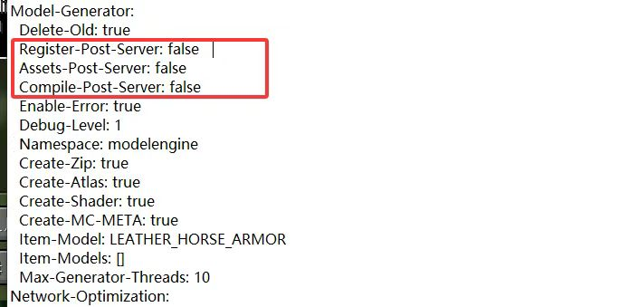

# ModelEngine

## [Download here](https://www.spigotmc.org/resources/conxeptworks-model-engine%E2%80%94ultimate-entity-model-manager-1-14-1-17-1.79477/)

## How to add compatibility?

* add all your mobs models and configurations inside the **ModelEngine** plugin folder (read the **ModelEngine** tutorials for more info)
* open `config.yml` of **ItemsAdder** and set this:

```yaml
    merge_other_plugins_resourcepacks_folders:
      - "ModelEngine/resource pack"
```

* run `/meg reload` to generate the **ModelEngine** resourcepack.
* `/iazip` (and follow the [hosting tutorial](../../plugin-usage/plugin-configuration/resourcepack-hosting/) if needed).

### Differences between ItemsAdder and ModelEngine


[modelengine-vs-itemsadder.md](../../faq/modelengine-vs-itemsadder.md)


## `NoSuchFileException` issue

```
[ItemsAdder] Plugin ItemsAdder v4.0.15 generated an exception while executing task 9132
java.io.UncheckedIOException: java.nio.file.NoSuchFileException: /home/container/plugins/ModelEngine/resource pack/assets/minecraft
        at org.apache.commons.io.function.Uncheck.wrap(Uncheck.java:339) ~[commons-io-2.17.0.jar:2.17.0]
```

Open the `config.yml` file of **ModelEngine** and set the highlighted options to `false`.\
This forces **ModelEngine** to load its resources during the early stages of server startup, rather than waiting until the server has fully initialized.

The root cause lies in plugin load order: ItemsAdder attempts to access ModelEngine’s model files before ModelEngine has finished loading its resources, so it cannot access them.

<figure><figcaption></figcaption></figure>
