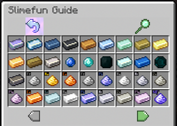

# Slimefun4

## [Download here](https://github.com/Slimefun/Slimefun4#download-slimefun-4)

## How to install the Slimefun resourcepack


Optifine is not required!



Note: this is not the official resourcepack and I'm not its author. Please don't ask for support. Thanks.


* Download the resourcepack [here](https://www.planetminecraft.com/texture-pack/slimefun-texture-by-raulh22/)
* Paste the [items-model.yml](https://www.mediafire.com/file/4s42i4b1uk6r05j/file) file inside the Slimefun folder
* Merge the Slimefun resourcepack with ItemsAdder resourcepack ([read here](../../plugin-usage/merge-resourcepacks/))
* Done

