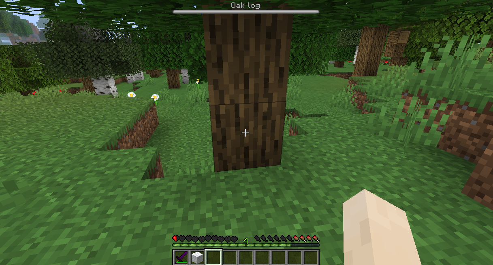

# Wailat

## [Download Here](https://www.spigotmc.org/resources/wailat-inspired-by-forge-waila-mod-itemsadder-compatibility.67040/)

Get name of the block you're looking at in real-time.

<figure><figcaption></figcaption></figure>
