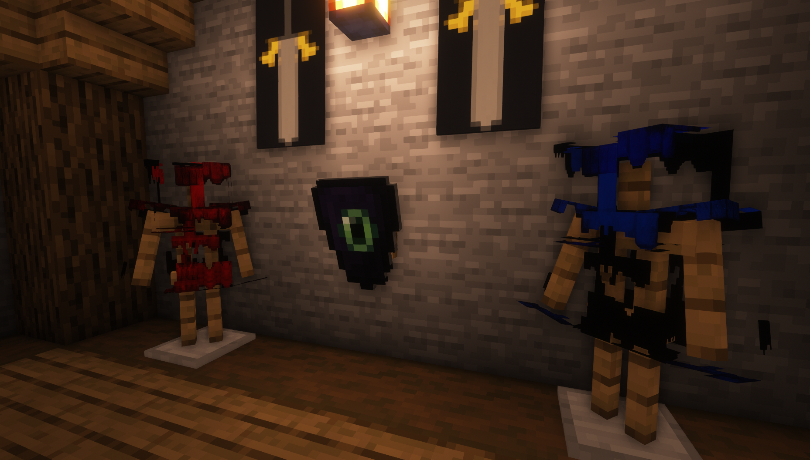
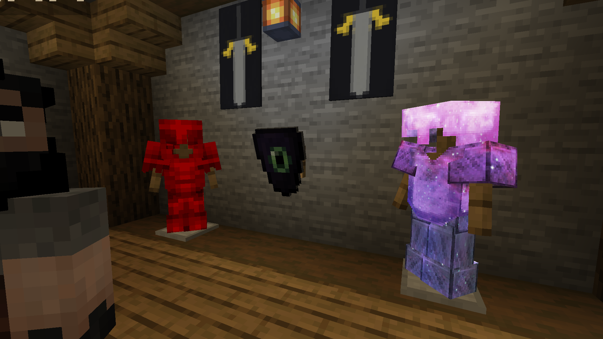

# Textures broken by shaders mod


### This bug was fixed in ItemsAdder 3.0.3

If you see broken textures make sure you are using ItemsAdder 3.0.3 or a more recent version.\
Also make sure you regenerated your resourcepack using `/iazip` (and read the [hosting tutorial](../../plugin-usage/resourcepack-hosting/) if needed).
















## What was the cause of this bug?

### Optifine issue

Optifine has a limitation which doesn't allow custom armors to work correctly if you have any custom Optifine shader installed.

You have to disable the **Optifine** shaders temporarily or temporarily live with the issue.

I already contacted Optifine developer about this: [https://github.com/sp614x/optifine/issues/6391](https://github.com/sp614x/optifine/issues/6391)

### Iris Shaders issue

Iris has a limitation which doesn't allow custom armors to work correctly if you have any custom Iris custom shader installed.

I already contacted Iris developers about this: [https://github.com/IrisShaders/Iris/issues/1042](https://github.com/IrisShaders/Iris/issues/1042)
