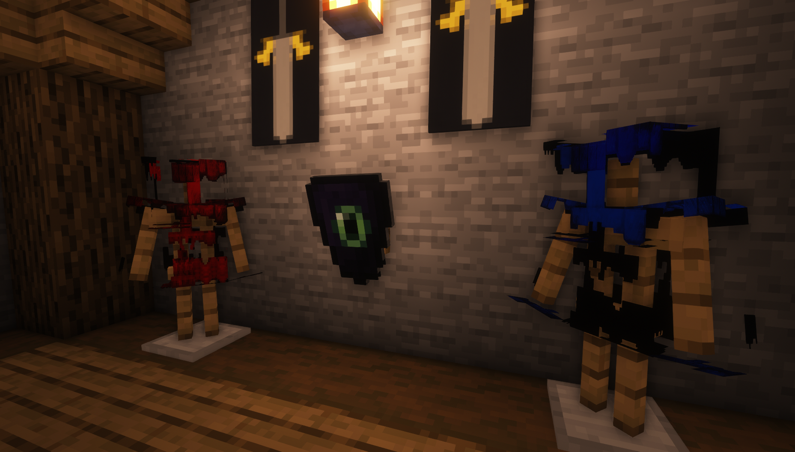
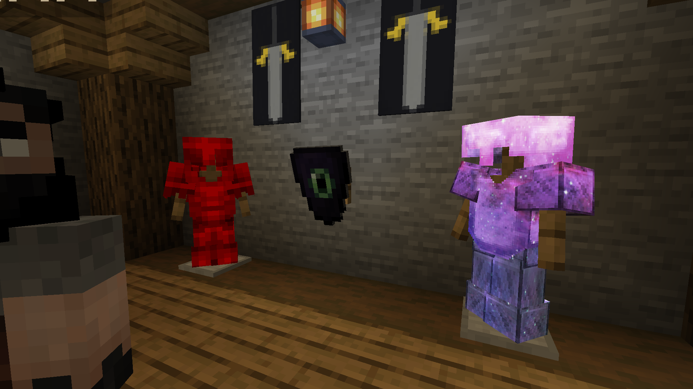

# Armors textures not working with shaders mod


If you are on 1.21.2 and greater (both server and clients) you can use the new armors creation method that doesn't use any vanilla shader to create custom armors, so it is compatible with the shaders mods.

More info [here](../../adding-content/items/armors.md).




## What was the cause of this bug?

### Optifine issue

Optifine has a limitation which doesn't allow custom armors to work correctly if you have any custom Optifine shaders installed.

You have to disable the **Optifine** shaders temporarily or temporarily live with the issue.

I already contacted Optifine developer about this: [https://github.com/sp614x/optifine/issues/6391](https://github.com/sp614x/optifine/issues/6391)

### Iris Shaders issue

Iris has a limitation which doesn't allow custom armors to work correctly if you have any custom Iris custom shader installed.

I already contacted Iris developers about this: [https://github.com/IrisShaders/Iris/issues/1042](https://github.com/IrisShaders/Iris/issues/1042)
