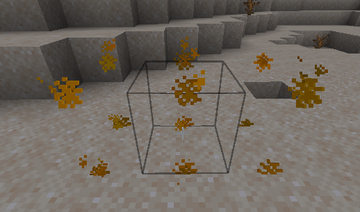

# 家具碰撞

### 如何使家具变得坚固？

你可以通过添加 "solid" 属性并指定一个碰撞箱（如果你想要 > 1x1x1）来使家具变得坚固。

```yaml
  table:
    display_name: display-name-table
    permission: table
    lore:
      - 'lore-decorative-item'
    resource:
      material: OAK_WOOD
      generate: false
      model_path: item/table
    behaviours:
      furniture:
        small: true
        solid: true
        entity: armor_stand
        hitbox:
          length: 1
          width: 1
          height: 1
          length_offset: 0
          width_offset: 0
          height_offset: 0
```

.png>)

## 碰撞箱位置错误<a href="#show-the-hitbox" id="show-the-hitbox"></a>


有时你需要设置一个补偿来修正碰撞箱位置。\
例如，你的家具大小为 2x1x1。


### 错误碰撞箱位置



### 正确位置 <a href="#show-the-hitbox" id="show-the-hitbox"></a>

.png>)

我将宽度**补偿**设置为了 **0.5**.\
你也可以在必要时使用负向补偿。

```yaml
        hitbox:
          length: 1
          width: 2
          height: 1
          width_offset: 0.5
```

## 预览碰撞箱 <a href="#show-the-hitbox" id="show-the-hitbox"></a>


你可以使用命令 `/iahitbox` 来查看你放置家具时的碰撞箱，这对于检测碰撞箱配置中的错误非常有用。


 (1) (1) (8).png>)

.png)

.png)


**碰撞箱限制**

**`item_frame` 限制(不影响 `armor_stand`)**

使用 `entity: item_frame` 的**家具**仅支持宽度和长度相同的碰撞箱。\
例如：`width: 2`, `length: 2`, `height: 1`。

\
如果你想要不同的宽度和长度，请使用 `entity: item_display` 或 `armor_stand`。

