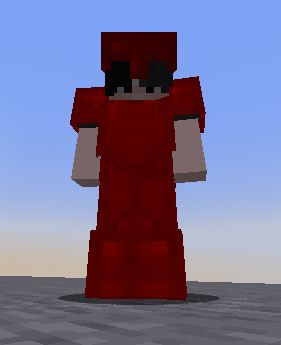

# (old) Simple Armor


This method is suggested for ItemsAdder 4.0.8 and lower.\
This is made for clients with version lower than 1.21.2.

ItemsAdder 4.0.9+ and Minecraft 1.21.2+ support a new way of making armors.\
[Read more here](../armors.md).&#x20;


This is a simple armor which is created automatically without textures, ItemsAdder will generate it from the color you decided and will be similar to iron/diamond armors but with different color.

### Creating an armor piece

Let's create a chestplate.\
To create other pieces you just have to repeat the following method and change the `slot`.

```yaml
  my_armor_simple_chestplate:
    display_name: my_armor_simple chestplate
    permission: myarmor
    resource:
      generate: true
    durability:
      max_custom_durability: 400
    specific_properties:
      armor:
        slot: chest
        color: '#ff0001'
    attribute_modifiers:
      chest:
        armor: 7
        armorToughness: 1
```

The `color` property is important, it's the color that the armor will have ingame.

## Done!

Nothing more to do. You just created a simple armor without drawing any texture!

<figure><figcaption></figcaption></figure>

<figure><figcaption></figcaption></figure>

## Full configuration from the previous example

<details>

<summary>Click here to read the configuration file</summary>

```yaml
info:
  namespace: my_items
items:
  my_armor_simple_helmet:
    display_name: my_armor_simple helmet
    permission: my_armor_simple
    resource:
      generate: true
    durability:
      max_custom_durability: 275
    specific_properties:
      armor:
        slot: head
        color: '#ff0001'
    attribute_modifiers:
      head:
        armor: 9
        armorToughness: 1
  my_armor_simple_chestplate:
    display_name: my_armor_simple chestplate
    permission: myarmor
    resource:
      generate: true
    durability:
      max_custom_durability: 400
    specific_properties:
      armor:
        slot: chest
        color: '#ff0001'
    attribute_modifiers:
      chest:
        armor: 7
        armorToughness: 1
  my_armor_simple_leggings:
    display_name: my_armor_simple leggings
    permission: myarmor
    resource:
      generate: true
    durability:
      max_custom_durability: 375
    specific_properties:
      armor:
        slot: legs
        color: '#ff0001'
    attribute_modifiers:
      legs:
        armor: 5
        armorToughness: 1
  my_armor_simple_boots:
    display_name: my_armor_simple boots
    permission: myarmor
    resource:
      generate: true
    durability:
      max_custom_durability: 325
    specific_properties:
      armor:
        slot: FEET
        color: '#ff0001'
    attribute_modifiers:
      feet:
        armor: 3
        armorToughness: 1
```


</details>


Extract the zip into the `contents` folder of ItemsAdder

