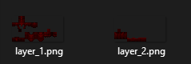

# Armors


Available on ItemsAdder 4.0.9 or greater only.\
Requires Minecraft client and server 1.21.2 or greater.

For older versions tutorials read here: [simple armor](armors-old/simple-armor.md) or [textured armor](armors-old/textured-armor.md).


## Wear texture configuration

```yaml
equipments:
  my_armor_1:
    type: armor
    layer_1: armor/my_armor_1/layer_1
    layer_2: armor/my_armor_1/layer_2
```

The `equipment` is a property which contains the information how to show the armor in-game on the player body.

Create the layers files inside the folder: `contents/my_armor_tutorial/textures/armor/my_armor_1` .

<figure><figcaption></figcaption></figure>

## Item configuration

In this example I will show how to create a **chestplate**, the same can be done to create other armor pieces.

```yaml
  my_armor_1_chestplate:
    name: My Armor 1 Chestplate
    resource:
      generate: true
      texture: item/my_armor_1_chestplate
      material: IRON_CHESTPLATE
    durability:
      max_durability: 165
    equipment:
      id: my_armor_tutorial:my_armor_1
      slot_attribute_modifiers:
        armor: 1
```

As you can see I set the `material` to `IRON_CHESTPLATE`.

I also set the `equipment.id` property to `my_armor_tutorial:my_armor_1`.\
This loads our previously created equipment settings.

## Inventory item textures

Create the item texture and put it inside the folder:\
`contents/my_armor_tutorial/textures/item`.

<figure><figcaption></figcaption></figure>

.png>)

## Extra: Custom 3D helmet

Currently only helmets support 3D models due to a Minecraft limitation I cannot fix.

```yaml
  my_armor_1_helmet_3d:
    name: My Armor 1 Helmet 3D
    resource:
      generate: false
      model_path: armor/my_armor_1_helmet_3d
      material: IRON_HELMET
    durability:
      max_durability: 165
    equipment:
      slot_attribute_modifiers:
        armor: 2.5
```


Do not put any `id` in the `equipment`, otherwise the previous layer texture would be used instead of the custom `model_path`.


<figure><figcaption></figcaption></figure>

### Full configuration from the previous example

<details>

<summary>Click here to read the configuration file</summary>

```yaml
info:
  namespace: my_armor_tutorial
equipments:
  my_armor_1:
    type: armor
    layer_1: armor/my_armor_1/layer_1
    layer_2: armor/my_armor_1/layer_2
items:
  my_armor_1_helmet:
    name: My Armor 1 Helmet
    resource:
      generate: true
      texture: item/my_armor_1_helmet
      material: IRON_HELMET
    durability:
      max_durability: 165
    equipment:
      id: my_armor_tutorial:my_armor_1
      slot_attribute_modifiers:
        armor: 2.5
  my_armor_1_chestplate:
    name: My Armor 1 Chestplate
    resource:
      generate: true
      texture: item/my_armor_1_chestplate
      material: IRON_CHESTPLATE
    durability:
      max_durability: 165
    equipment:
      id: my_armor_tutorial:my_armor_1
      slot_attribute_modifiers:
        armor: 1
  my_armor_1_leggings:
    name: My Armor 1 Leggings
    resource:
      generate: true
      texture: item/my_armor_1_leggings
      material: IRON_LEGGINGS
    durability:
      max_durability: 165
    equipment:
      id: my_armor_tutorial:my_armor_1
      slot_attribute_modifiers:
        armor: 2.5
  my_armor_1_boots:
    name: My Armor 1 Boots
    resource:
      generate: true
      texture: item/my_armor_1_boots
      material: IRON_BOOTS
    durability:
      max_durability: 165
    equipment:
      id: my_armor_tutorial:my_armor_1
      slot_attribute_modifiers:
        armor: 2.5

```

</details>



## Animated/emissive armors

The current custom armors method doesn't support animated and emissive textures.\
To create animated or/and emissive textures you have to use [the old method shown here](armors-old/textured-armor.md) (uses shaders).

## **HD armor textures**

I do not advice to use HD textures since this is a blocky game, but can create HD high resolution, but make sure they have the same proportions of the original vanilla armors layers textures.

<mark style="color:red;">Size must be a power of 2</mark>, for example: 64x32, 128x64, 256x128, 512x256.

## Multi-version compatibility


This custom armors feature is only available on 1.21.2 and greater clients and servers.

There is a simple solution if your server uses **ViaVersion** or similar, but has some downsides and it should be considered as a legacy feature. I discourage using that feature.


You have to create both properties `equipments` and `armors_rendering`.

* `armors_rendering` is the old method (uses a custom shader).
* `equipments` is the new method (uses the vanilla equipment attribute).

```yaml
info:
  namespace: my_armor_tutorial_legacy_fix
equipments:
  my_armor_legacy_fix_1:
    type: armor
    layer_1: armor/my_armor_legacy_fix_1/layer_1
    layer_2: armor/my_armor_legacy_fix_1/layer_2
legacy_armor_renderings:
  my_armor_legacy_fix_1_shader:
    layer_1: armor/my_armor_legacy_fix_1/layer_1
    layer_2: armor/my_armor_legacy_fix_1/layer_2
    color: "570e11"
```

You have to set material to `LEATHER`, for each piece, in this case `LEATHER_CHESTPLATE`.

You then have to set the `equipment.legacy_armor_rendering_id` and `equipment.id` to the previously created properties.

```yaml
  my_armor_legacy_fix_1_chestplate:
    name: My Armor 1 Chestplate Legacy Fix
    resource:
      generate: true
      texture: item/my_armor_legacy_fix_1_chestplate
      material: LEATHER_CHESTPLATE
    durability:
      max_durability: 165
    equipment:
      id: my_armor_legacy_fix_1
      legacy_armor_rendering_id: my_armor_legacy_fix_1_shader
      slot_attribute_modifiers:
        armor: 1
```

### Extra: Custom 3D helmet

```yaml
  my_armor_1_helmet_3d:
    name: My Armor 1 Helmet 3D
    resource:
      generate: false
      model_path: armor/my_armor_1_helmet_3d
      material: IRON_HELMET
    durability:
      max_durability: 165
    equipment:
      slot_attribute_modifiers:
        armor: 2.5
```

Minecraft 1.21.1 and lower do not support helmets (`DIAMOND_HELMET`, `LEATHER_HELMET` etc.) to create 3D hats due to a Minecraft limitation I cannot fix.

In this case, to support legacy clients too, you must use a different material like `PAPER` and use the `hat` `behaviour` instead.

```yaml
  my_armor_1_helmet_3d:
    name: My Armor 1 Helmet 3D
    resource:
      generate: false
      model_path: armor/my_armor_1_helmet_3d
      material: PAPER
    durability:
      max_durability: 165
    behaviours:
      hat: true
```

### Full configuration from the previous example

<details>

<summary>Click here to read the configuration file</summary>

```yaml
info:
  namespace: my_armor_tutorial_legacy_fix
equipments:
  my_armor_legacy_fix_1:
    type: armor
    layer_1: armor/my_armor_legacy_fix_1/layer_1
    layer_2: armor/my_armor_legacy_fix_1/layer_2
armors_rendering:
  my_armor_legacy_fix_1_shader:
    layer_1: armor/my_armor_legacy_fix_1/layer_1
    layer_2: armor/my_armor_legacy_fix_1/layer_2
    color: "570e11"
items:
  my_armor_legacy_fix_1_helmet:
    name: My Armor 1 Helmet Legacy Fix
    resource:
      generate: true
      texture: item/my_armor_legacy_fix_1_helmet
      material: LEATHER_HELMET
    durability:
      max_durability: 165
    equipment:
      id: my_armor_tutorial_legacy_fix:my_armor_legacy_fix_1
      slot_attribute_modifiers:
        armor: 2.5
    specific_properties:
      armor:
        slot: head
        custom_armor: my_armor_legacy_fix_1_shader
  my_armor_legacy_fix_1_chestplate:
    name: My Armor 1 Chestplate Legacy Fix
    resource:
      generate: true
      texture: item/my_armor_legacy_fix_1_chestplate
      material: LEATHER_CHESTPLATE
    durability:
      max_durability: 165
    equipment:
      id: my_armor_tutorial_legacy_fix:my_armor_legacy_fix_1
      slot_attribute_modifiers:
        armor: 1
    specific_properties:
      armor:
        slot: chest
        custom_armor: my_armor_legacy_fix_1_shader
  my_armor_legacy_fix_1_leggings:
    name: My Armor 1 Leggings Legacy Fix
    resource:
      generate: true
      texture: item/my_armor_legacy_fix_1_leggings
      material: LEATHER_LEGGINGS
    durability:
      max_durability: 165
    equipment:
      id: my_armor_tutorial_legacy_fix:my_armor_legacy_fix_1
      slot_attribute_modifiers:
        armor: 2.5
    specific_properties:
      armor:
        slot: legs
        custom_armor: my_armor_legacy_fix_1_shader
  my_armor_legacy_fix_1_boots:
    name: My Armor 1 Boots Legacy Fix
    resource:
      generate: true
      texture: item/my_armor_legacy_fix_1_boots
      material: LEATHER_BOOTS
    durability:
      max_durability: 165
    equipment:
      id: my_armor_tutorial_legacy_fix:my_armor_legacy_fix_1
      slot_attribute_modifiers:
        armor: 2.5
    specific_properties:
      armor:
        slot: feet
        custom_armor: my_armor_legacy_fix_1_shader
  my_armor_legacy_fix_1_helmet_3d:
    name: My Armor Legacy Fix 1 Helmet 3d
    resource:
      generate: false
      model_path: armor/my_armor_legacy_fix_1_helmet_3d
      material: PAPER
    durability:
      max_durability: 165
    behaviours:
      hat: true
    attribute_modifiers:
      head:
        armor: 2.5

```

</details>



## Converting old armors to the new equipment tag

### Mode 1

This setting allows you to append the new equipment setting and use the old shader method + the new method at the same time, so old clients will still see armors even if they are not on 1.21.2+.


```yml
advanced:
  legacy_shader_armor_conversion:
    append_new_equipment_tag:
      enabled: true
```


### Mode 2

This option will convert the armors completely to use the new equipment tag. Note that old clients won't see the armor anymore (older than 1.21.2).


```yml
advanced:
    completely_convert_to_new_equipment_tag:
      enabled: true
      new_armor_material: IRON
```

