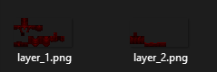

# Armors




Available on ItemsAdder 4.0.9 or greater only.\
Requires Minecraft client and server 1.21.2 or greater.


## Wear texture configuration

```yaml
equipments:
  my_armor_1:
    type: armor
    layer_1: armor/my_armor_1/layer_1
    layer_2: armor/my_armor_1/layer_2
```

The `equipment` is a property which contains the information how to show the armor in-game on the player body.

Create the layers files inside the folder: `contents/my_armor_tutorial/textures/armor/my_armor_1` .

<figure><figcaption></figcaption></figure>

## Item configuration

In this example I will show how to create a **chestplate**, the same can be done to create other armor pieces.

```yaml
  my_armor_1_chestplate:
    name: My Armor 1 Chestplate
    resource:
      generate: true
      texture: item/my_armor_1_chestplate
      material: IRON_CHESTPLATE
    durability:
      max_durability: 165
    equipment:
      id: my_armor_tutorial:my_armor_1
      slot_attribute_modifiers:
        armor: 1
```

As you can see I set the `material` to `IRON_CHESTPLATE`.

I also set the `equipment.id` property to `my_armor_tutorial:my_armor_1`.\
This loads our previously created equipment settings.

## Inventory item textures

Create the item texture and put it inside the folder:\
`contents/my_armor_tutorial/textures/item`.

<figure><figcaption></figcaption></figure>

.png>)

## Extra: Custom 3D helmet

Currently only helmets support 3D models due to a Minecraft limitation I cannot fix.

```yaml
  my_armor_1_helmet_3d:
    name: My Armor 1 Helmet 3D
    resource:
      generate: false
      model_path: armor/my_armor_1_helmet_3d
      material: IRON_HELMET
    durability:
      max_durability: 165
    equipment:
      slot_attribute_modifiers:
        armor: 2.5
```


Do not put any `id` in the `equipment`, otherwise the previous layer texture would be used instead of the custom `model_path`.


<figure><figcaption></figcaption></figure>

### Full configuration from the previous example

<details>

<summary>Click here to read the configuration file</summary>

```yaml
info:
  namespace: my_armor_tutorial
equipments:
  my_armor_1:
    type: armor
    layer_1: armor/my_armor_1/layer_1
    layer_2: armor/my_armor_1/layer_2
items:
  my_armor_1_helmet:
    name: My Armor 1 Helmet
    resource:
      generate: true
      texture: item/my_armor_1_helmet
      material: IRON_HELMET
    durability:
      max_durability: 165
    equipment:
      id: my_armor_tutorial:my_armor_1
      slot_attribute_modifiers:
        armor: 2.5
  my_armor_1_chestplate:
    name: My Armor 1 Chestplate
    resource:
      generate: true
      texture: item/my_armor_1_chestplate
      material: IRON_CHESTPLATE
    durability:
      max_durability: 165
    equipment:
      id: my_armor_tutorial:my_armor_1
      slot_attribute_modifiers:
        armor: 1
  my_armor_1_leggings:
    name: My Armor 1 Leggings
    resource:
      generate: true
      texture: item/my_armor_1_leggings
      material: IRON_LEGGINGS
    durability:
      max_durability: 165
    equipment:
      id: my_armor_tutorial:my_armor_1
      slot_attribute_modifiers:
        armor: 2.5
  my_armor_1_boots:
    name: My Armor 1 Boots
    resource:
      generate: true
      texture: item/my_armor_1_boots
      material: IRON_BOOTS
    durability:
      max_durability: 165
    equipment:
      id: my_armor_tutorial:my_armor_1
      slot_attribute_modifiers:
        armor: 2.5

```

</details>



## Animated/emissive armors

The current custom armors method doesn't support animated and emissive textures.\
To create animated or/and emissive textures you have to use [the old method shown here](armors-old/textured-armor.md) (uses shaders).

## **HD armor textures**

I do not advice to use HD textures since this is a blocky game, but can create HD high resolution, but make sure they have the same proportions of the original vanilla armors layers textures.

<mark style="color:red;">Size must be a power of 2</mark>, for example: 64x32, 128x64, 256x128, 512x256.

## Multi-version compatibility


This custom armors feature is only available on 1.21.2 and greater clients and servers.

There is a simple solution if your server uses **ViaVersion** or similar, but has some downsides and it should be considered as a legacy feature. I discourage using that feature.


You have to create both properties `equipments` and `armors_rendering`.

* `armors_rendering` is the old method (uses a custom shader).
* `equipments` is the new method (uses the vanilla equipment attribute).

```yaml
info:
  namespace: my_armor_tutorial_legacy_fix
equipments:
  my_armor_legacy_fix_1:
    type: armor
    layer_1: armor/my_armor_legacy_fix_1/layer_1
    layer_2: armor/my_armor_legacy_fix_1/layer_2
legacy_armor_renderings:
  my_armor_legacy_fix_1_shader:
    layer_1: armor/my_armor_legacy_fix_1/layer_1
    layer_2: armor/my_armor_legacy_fix_1/layer_2
    color: "570e11"
```

You have to set material to `LEATHER`, for each piece, in this case `LEATHER_CHESTPLATE`.

You then have to set the `equipment.legacy_armor_rendering_id` and `equipment.id` to the previously created properties.

```yaml
  my_armor_legacy_fix_1_chestplate:
    name: My Armor 1 Chestplate Legacy Fix
    resource:
      generate: true
      texture: item/my_armor_legacy_fix_1_chestplate
      material: LEATHER_CHESTPLATE
    durability:
      max_durability: 165
    equipment:
      id: my_armor_legacy_fix_1
      legacy_armor_rendering_id: my_armor_legacy_fix_1_shader
      slot_attribute_modifiers:
        armor: 1
```

### Extra: Custom 3D helmet

```yaml
  my_armor_1_helmet_3d:
    name: My Armor 1 Helmet 3D
    resource:
      generate: false
      model_path: armor/my_armor_1_helmet_3d
      material: IRON_HELMET
    durability:
      max_durability: 165
    equipment:
      slot_attribute_modifiers:
        armor: 2.5
```

Minecraft 1.21.1 and lower do not support helmets (`DIAMOND_HELMET`, `LEATHER_HELMET` etc.) to create 3D hats due to a Minecraft limitation I cannot fix.

In this case, to support legacy clients too, you must use a different material like `PAPER` and use the `hat` `behaviour` instead.

```yaml
  my_armor_1_helmet_3d:
    name: My Armor 1 Helmet 3D
    resource:
      generate: false
      model_path: armor/my_armor_1_helmet_3d
      material: PAPER
    durability:
      max_durability: 165
    behaviours:
      hat: true
```

### Full configuration from the previous example

<details>

<summary>Click here to read the configuration file</summary>

```yaml
info:
  namespace: my_armor_tutorial_legacy_fix
equipments:
  my_armor_legacy_fix_1:
    type: armor
    layer_1: armor/my_armor_legacy_fix_1/layer_1
    layer_2: armor/my_armor_legacy_fix_1/layer_2
armors_rendering:
  my_armor_legacy_fix_1_shader:
    layer_1: armor/my_armor_legacy_fix_1/layer_1
    layer_2: armor/my_armor_legacy_fix_1/layer_2
    color: "570e11"
items:
  my_armor_legacy_fix_1_helmet:
    name: My Armor 1 Helmet Legacy Fix
    resource:
      generate: true
      texture: item/my_armor_legacy_fix_1_helmet
      material: LEATHER_HELMET
    durability:
      max_durability: 165
    equipment:
      id: my_armor_tutorial_legacy_fix:my_armor_legacy_fix_1
      slot_attribute_modifiers:
        armor: 2.5
    specific_properties:
      armor:
        slot: head
        custom_armor: my_armor_legacy_fix_1_shader
  my_armor_legacy_fix_1_chestplate:
    name: My Armor 1 Chestplate Legacy Fix
    resource:
      generate: true
      texture: item/my_armor_legacy_fix_1_chestplate
      material: LEATHER_CHESTPLATE
    durability:
      max_durability: 165
    equipment:
      id: my_armor_tutorial_legacy_fix:my_armor_legacy_fix_1
      slot_attribute_modifiers:
        armor: 1
    specific_properties:
      armor:
        slot: chest
        custom_armor: my_armor_legacy_fix_1_shader
  my_armor_legacy_fix_1_leggings:
    name: My Armor 1 Leggings Legacy Fix
    resource:
      generate: true
      texture: item/my_armor_legacy_fix_1_leggings
      material: LEATHER_LEGGINGS
    durability:
      max_durability: 165
    equipment:
      id: my_armor_tutorial_legacy_fix:my_armor_legacy_fix_1
      slot_attribute_modifiers:
        armor: 2.5
    specific_properties:
      armor:
        slot: legs
        custom_armor: my_armor_legacy_fix_1_shader
  my_armor_legacy_fix_1_boots:
    name: My Armor 1 Boots Legacy Fix
    resource:
      generate: true
      texture: item/my_armor_legacy_fix_1_boots
      material: LEATHER_BOOTS
    durability:
      max_durability: 165
    equipment:
      id: my_armor_tutorial_legacy_fix:my_armor_legacy_fix_1
      slot_attribute_modifiers:
        armor: 2.5
    specific_properties:
      armor:
        slot: feet
        custom_armor: my_armor_legacy_fix_1_shader
  my_armor_legacy_fix_1_helmet_3d:
    name: My Armor Legacy Fix 1 Helmet 3d
    resource:
      generate: false
      model_path: armor/my_armor_legacy_fix_1_helmet_3d
      material: PAPER
    durability:
      max_durability: 165
    behaviours:
      hat: true
    attribute_modifiers:
      head:
        armor: 2.5

```

</details>



## Converting old armors to the new equipment tag

### Mode 1

This setting allows you to append the new equipment setting and use the old shader method + the new method at the same time, so old clients will still see armors even if they are not on 1.21.2+.


```yaml
advanced:
  legacy_shader_armor_conversion:
    append_new_equipment_tag:
      enabled: true
```


### Mode 2

This option will convert the armors completely to use the new equipment tag. Note that old clients won't see the armor anymore (older than 1.21.2).


```yaml
advanced:
    completely_convert_to_new_equipment_tag:
      enabled: true
      new_armor_material: IRON
```




## Custom wear texture


The `vanilla` feature requires Minecraft 1.17 or greater.\
It can't work on Minecraft 1.16 and previous versions.

To make 1.16 clients see the custom armors you can enable also the `optifine` attribute, this will allow old clients to see the armors anyway.

This is also useful as fallback for people who use custom shaders, which are not compatible with the custom armors vanilla shaders.



If you see **bugged** textures and you have **Optifine** installed please [read here](../../../faq/armors-issues/armors-textures-not-working-with-shaders-mod.md).


### Creating the armor renderer


An armor renderer is a setting which contains the information how to show the armor ingame on the player body.\
It is a configuration which specified how the game will show the armor ingame.

Note: there can be only one armor renderer with per color.


```yaml
info:
  namespace: my_items
armors_rendering:
  my_armor:
    color: "#d60000"
    layer_1: armor/my_armor/layer_1
    layer_2: armor/my_armor/layer_2
    use_color: false
```


You must decide a color! Even if the armor won't be colored. The color is like an ID (identifier) for the custom armor renderer.


* `use_color: false` disables the recoloring of the armor using the specified `color: "#d60000"`. It would have colored the armor texture if were set to `true`.\
  In some cases you may want to recolor the armor using the specified `color`, so you will have to set it to `true`.\
  This option will also make the item (in inventory) not colored automatically anymore.
* `color` is the color attribute of this armor.\
  It acts like an **unique identifier** for the armor (and will tint the armor if `use_color` is `true`). Use this website to get a valid color: [https://minecraftcommand.science/armor-color](https://minecraftcommand.science/armor-color).\
  Note: ItemsAdder will automatically select a nearest unused color if the selected one is already used by another custom armor.

Now I create the two PNG files inside the `contents/my_items/textures/armor/my_armor/` folder.

<figure><figcaption></figcaption></figure>


**HD armor textures**

You can create HD high resolution armors too!\
Just make sure they have the same proportions of the original.\
For example:\
64x32, 128x64, 256x128, 512x256... <mark style="color:red;">it's very important! Size must be a power of 2.</mark>



It's not really advised to use HD textures since this is a blocky game.\
Lot of HD textures can cause issues because there is a different size limit for each Graphical Card.

So it's better to stick with the vanilla texture size if you want to avoid risking issues.


### Creating an armor piece

Let's create a chestplate.\
To create other pieces you just have to repeat the following method and change the `slot`.

```yaml
  my_armor_chest:
    display_name: my_armor chestplate
    permission: my_armor
    resource:
      generate: true
      textures:
      - item/my_armor/chestplate
    durability:
      max_custom_durability: 400
    specific_properties:
      armor:
        slot: chest
        custom_armor: my_armor
    attribute_modifiers:
      chest:
        armor: 7
        armorToughness: 1
```


Make sure that no `material` property is set. This is handled automatically by the plugin for custom textured armors. Armor won't work if a `material` has been set.


The `custom_armor` property is important, it makes the plugin apply the previous `armors_renderer` setting to this armor piece.

In this case I didn't specify any `color` in the `specific_properties` field of the armor piece because it's automatically applied by the `custom_armor` property, inherited from the `armors_renderer`.

Now I create the item texture and I put it inside the folder:\
`contents/my_items/textures/item/my_armor/`.

In this example I created also a new folder called `my_armor` to better organize the resourcepack since you will have 1 texture for each armor piece, and having them in the same textures folder might cause confusion.

`contents/my_items/textures/item/my_armor/chestplate.png`


.png>)

### Animated textures

You can also create animated armors!

.gif>)

To create an animated armor you have to create an image with all the animation frames.\
Each frame must be under the previous. This is an example this is a 3 frames animation:


Now let's edit the rendering properties to support the animation.

```yaml
info:
  namespace: my_items
armors_rendering:
  my_armor:
    color: "#d60000"
    layer_1: armor/my_armor/layer_1
    layer_2: armor/my_armor/layer_2
    use_color: false
    animation:
      interpolation: true
```

In this case I set `interpolation: true` because I want the animation to be smooth.

Default speed is 24, but you can customize it until you find the right speed value:

```yaml
    animation:
      speed: 30
      interpolation: true
```

### Emissive textures (glowing in the dark)

You can also create emissive textures which glow in the dark. (You can make both animated and emissive textures at the same time!)

```yaml
info:
  namespace: my_items
armors_rendering:
  my_armor:
    color: "#d60000"
    layer_1: armor/my_armor/layer_1
    layer_2: armor/my_armor/layer_2
    emissive_1: armor/my_armor/emissive_1
    emissive_2: armor/my_armor/emissive_2
    use_color: false
```

In this case I want to make the previous animation emissive, I want it to glow in the dark.\
You have to make 2 textures in order to make the textures glow.\
The **transparent** part **won't glow** while the colored part will glow.

You basically just have to copy and paste your texture and erase the parts you don't want to glow.

## Extra: Custom 3D helmet


Currently only items equipped on the head support 3D due to Minecraft limitations.


This is an example on how to create a custom helmet that has a 3D model and not just a texture.

```yaml
info:
  namespace: my_items
items:
  test_3d_helmet:
    display_name: Test 3D Helmet
    resource:
      generate: false
      model_path: item/test_3d_helmet
      material: PAPER
    durability:
      max_durability: 1562
    behaviours:
      hat: true
```


Make sure to use a `material` like `PAPER` and not an helmet, otherwise the 3D model would not be visible when equipped.



Custom helmets support durability only on ItemsAdder 4.0.8+.


## Full configuration from the previous example

<details>

<summary>Click here to read the configuration file</summary>

```yaml
info:
  namespace: myitems
armors_rendering:
  myarmor:
    color: "#d60000"
    layer_1: armor/myarmor/layer_1
    layer_2: armor/myarmor/layer_2
items:
  myarmor_helmet:
    display_name: myarmor helmet
    permission: myarmor
    resource:
      generate: true
      textures:
      - item/myarmor/helmet
    durability:
      max_custom_durability: 275
    specific_properties:
      armor:
        slot: head
        custom_armor: myarmor
    attribute_modifiers:
      head:
        armor: 9
        armorToughness: 1
  myarmor_chestplate:
    display_name: myarmor chestplate
    permission: myarmor
    resource:
      generate: true
      textures:
      - item/myarmor/chestplate
    durability:
      max_custom_durability: 400
    specific_properties:
      armor:
        slot: chest
        custom_armor: myarmor
    attribute_modifiers:
      chest:
        armor: 7
        armorToughness: 1
  myarmor_leggings:
    display_name: myarmor leggings
    permission: myarmor
    resource:
      generate: true
      textures:
      - item/myarmor/leggings
    durability:
      max_custom_durability: 375
    specific_properties:
      armor:
        slot: legs
        custom_armor: myarmor
    attribute_modifiers:
      legs:
        armor: 5
        armorToughness: 1
  myarmor_boots:
    display_name: myarmor boots
    permission: myarmor
    resource:
      generate: true
      textures:
      - item/myarmor/boots
    durability:
      max_custom_durability: 325
    specific_properties:
      armor:
        slot: FEET
        custom_armor: myarmor
    attribute_modifiers:
      feet:
        armor: 3
        armorToughness: 1
```

</details>


Extract the zip into the `contents` folder of ItemsAdder


## FAQ


`armors_rendering` was renamed to `legacy_armor_renderings` in ItemAdder 4.0.9.\
The old property still works to maintain compatibility.




This is a simple armor which is created automatically without textures, ItemsAdder will generate it from the color you decided and will be similar to iron/diamond armors but with different color.

### Creating an armor piece

Let's create a chestplate.\
To create other pieces you just have to repeat the following method and change the `slot`.

```yaml
  my_armor_simple_chestplate:
    display_name: my_armor_simple chestplate
    permission: myarmor
    resource:
      generate: true
    durability:
      max_custom_durability: 400
    specific_properties:
      armor:
        slot: chest
        color: '#ff0001'
    attribute_modifiers:
      chest:
        armor: 7
        armorToughness: 1
```

The `color` property is important, it's the color that the armor will have ingame.

## Done!

Nothing more to do. You just created a simple armor without drawing any texture!

<figure><figcaption></figcaption></figure>

<figure><figcaption></figcaption></figure>

## Full configuration from the previous example

<details>

<summary>Click here to read the configuration file</summary>

```yaml
info:
  namespace: my_items
items:
  my_armor_simple_helmet:
    display_name: my_armor_simple helmet
    permission: my_armor_simple
    resource:
      generate: true
    durability:
      max_custom_durability: 275
    specific_properties:
      armor:
        slot: head
        color: '#ff0001'
    attribute_modifiers:
      head:
        armor: 9
        armorToughness: 1
  my_armor_simple_chestplate:
    display_name: my_armor_simple chestplate
    permission: myarmor
    resource:
      generate: true
    durability:
      max_custom_durability: 400
    specific_properties:
      armor:
        slot: chest
        color: '#ff0001'
    attribute_modifiers:
      chest:
        armor: 7
        armorToughness: 1
  my_armor_simple_leggings:
    display_name: my_armor_simple leggings
    permission: myarmor
    resource:
      generate: true
    durability:
      max_custom_durability: 375
    specific_properties:
      armor:
        slot: legs
        color: '#ff0001'
    attribute_modifiers:
      legs:
        armor: 5
        armorToughness: 1
  my_armor_simple_boots:
    display_name: my_armor_simple boots
    permission: myarmor
    resource:
      generate: true
    durability:
      max_custom_durability: 325
    specific_properties:
      armor:
        slot: FEET
        color: '#ff0001'
    attribute_modifiers:
      feet:
        armor: 3
        armorToughness: 1
```


</details>


Extract the zip into the `contents` folder of ItemsAdder


