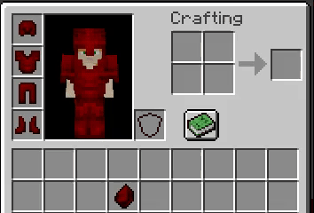

# 材质


使用 `vanilla_1_17` 功能 版本需求： ItemsAdder 2.4.22+ 以及 Minecraft 1.17+.\
要使1.17以下的版本能够显示自定义盔甲，你可以开启 `optifine` 属性，这样子就能在新老客户端上都能显示自定义盔甲
（ItemsAdder 可以自动将自定义盔甲添加到 1.16 及更低版本）



当你使用了 **Optifine** 时仍然显示 **错误** 的材质 [请阅读该页面](../../../faq/armors-bugs/textures-broken-by-shaders-mod.md).


## 创建盔甲渲染器


盔甲渲染器是包含如何在游戏中显示自定义盔甲的信息设置


```yaml
info:
  namespace: myitems
armors_rendering:
  my_armor:
    color: "#d60000"
    layer_1: armor/my_armor/layer_1
    layer_2: armor/my_armor/layer_2
    use_color: false
```

该配置指定了游戏将如何显示示例中的盔甲



即使不会显示在盔甲上,你也必须在盔甲渲染器中指定一个颜色! 因为颜色就像自定义盔甲的 ID.


`use_color` 属性为是否使用 `color` 中指定的颜色为盔甲进行染色 （`color: "#d60000"`) 
该功能不仅仅用于自定义盔甲材质，或许某些时候你需要指定颜色的染色皮革盔甲，此时你就可以将 `use_color` 设置为 `true`
**** 该选项还会使背包中使用同一 `color` 来自定义的盔甲失效（变为指定颜色的染色皮革盔甲）

`color` 是盔甲的颜色属性，也是盔甲的唯一标识（ID）（当 `use_color` 为 `true`时，（皮革）盔甲将会显示为 `color` 数值内的颜色）
使用该网站获取有效颜色：[https://minecraftcommand.science/armor-color](https://minecraftcommand.science/armor-color)

现在，在 `data/resource_pack/assets/myitems/textures/armor/my_armor/` 文件夹中放入盔甲的贴图文件(.PNG)

 (1) (1) (1) (1).png>)


### 高清盔甲材质

你可以制作高分辨率的自定义盔甲&#x20;

只需要注意分辨率需要与原来的贴图大小具有相同的比例.&#x20;

例如： 64x32, 128x64, 256x128, 512x256..... <mark style="color:red;">注意！！尺寸大小必须是2的倍数.</mark>


### 制作一件盔甲

例如：如下配置创建一个胸甲（你只需要按照相同的方法自行创建其他盔甲部件）

```yaml
  my_armor_chestplate:
    display_name: "My Armor Chestplate"
    permission: my_armor_chestplate
    resource:
      generate: true
      textures:
      - item/my_armor/chestplate
    durability:
      max_custom_durability: 602
    specific_properties:
      armor:
        slot: chest
        custom_armor: my_armor
    attribute_modifiers:
      chest:
        armor: 8
        armorToughness: 3
```

`custom_armor` 属性，它使插件使用之前的材质设置（`armors_renderer（盔甲渲染器）`）来处理该盔甲

因此，我在配置中并没有在 `specific_properties` 中去设置指定的 `颜色` ，因为在配置 `armors_renderer（盔甲渲染器）` 时已经完成指定了
现在，创建盔甲材质贴图并将其放入 `data\resource_pack\assets\myitems\textures\item\my_armor\` 文件夹中
（在此示例中，我还创建了一个名为 `my_armor` 的文件夹来对新增的自定义盔甲进行整合）
 (1) (1).png>)

 (1) (1).png>)

### 动态材质

你还可以制作动态的盔甲材质



要创建动态盔甲材质，你需要制作一张包含所有动画帧的贴图

<br>每一帧必须在前一帧的下方， 如下是一个3帧动画的示例：

.png>)


现在，让我们编辑盔甲渲染属性以支持动画

```yaml
info:
  namespace: myitems
armors_rendering:
  my_armor:
    color: "#d60000"
    layer_1: armor/my_armor/layer_1
    layer_2: armor/my_armor/layer_2
    use_color: false
    animation:
      interpolation: true
```

你可以发现我设置了 `interpolation: true` 属性，该属性可以使得动画更加平滑

动画默认速度为 24，但是你可以自定义一个觉得合适的速度值，

```yaml
    animation:
      speed: 30
      interpolation: true
```

### 发光材质

你还可以为其盔甲设置发光材质（并且可以同时设置贴图动画以及发光材质）
```yaml
info:
  namespace: myitems
armors_rendering:
  my_armor:
    color: "#d60000"
    layer_1: armor/my_armor/layer_1
    layer_2: armor/my_armor/layer_2
    emissive_1: armor/my_armor/emissive_1
    emissive_2: armor/my_armor/emissive_2
    use_color: false
```

当你想让盔甲的动态材质在黑暗中发光,你需要制作对应的 2 张发光材质贴图.\
将发光贴图的位置填入 `emissive_X` 属性中即可.\
实际上，你只需要复制动态材质贴图，并使用图像编辑软件 擦去不需要发光的部分像素即可.\
因为只有具有 **像素点** 的地方在游戏中才具有发光效果，光的亮度取决于此像素的透明度.\
默认A通道是100时 亮度等级是15（也就是最亮），该发光效果不会影响刷怪的光源.
