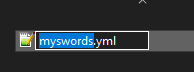

# Contents Folder

## Folders types

### contents

Is a folder which contains a set of sub-folders.\
Each one contains separated pack which contain configurations and models/textures/sounds...

You can see that each folder name in **contents** is the **namespace** of the assets it contains.

### resourcepack

You can see this folder and **configs** as a very similar thing, but **resourcepack** folder contains the "**graphical**" part of all **items** (and also sounds, GUIs...).


#### **Important**

Remember to always maintain order in **contents** sub-folders!\
Don't paste things randomly, don't create too many subfolders, don't leave unused textures/models or it will be difficult to find out errors and mistakes.


### Configurations

To create custom items, recipes, etc. ItemsAdder uses `.yml` files. You can have multiple configuration files to organize your work.

## What is a `namespace`?

ItemsAdder uses **`namespaces`** to identify most of the things it manages.\
A **`namespace`** is a **group** of elements, in this case a group of **items, blocks, mobs etc**.\
With namespaces you can easily understand where a particular **item**, **sound**, **block etc.** comes from.

### Example

All **realcraft** items are under the `realcraft` namespace, so when you use the `/iaget` command you can see all items IDs start with `realcraft:`

 (1).png>)

## How can I define my own namespace?

Create a subfolder inside: `plugins/ItemsAdder/contents/`

In this example I will create a **namespace** and call it `my_items`.

Open the `my_items` folder and create a new file, you can call it like as you prefer.\
For example: `contents/my_items/myswords.yml`



The **namespace** must be also specified in the file, so open the new `myswords.yml` file and paste this:

```yaml
info:
  namespace: my_items
```

Remember to change it based on your **namespace**.

You can create as many **namespaces** you want! This allows you to easily organize your packs of items.

You can create as many as `.yml` files you want in the same namespace! This is useful to organize content better.\
For example I divided swords, blocks, food, drinks in differnent `.yml` files.


**All this "nesting" could seem boring,** but it reduces errors and makes finding content easier.


## Why different folder structures choices?

**ItemsAdder** allows you to decide which folders structure to use in order to organize your various packs.

This is very useful for admins as they have freedom to organize their pack without worrying about much folders nesting.\
The easiest folder structure to use is the **structure method 1**.


Each **namespace** must use only one structure at a time.\
**Do not mix them in the same sub-pack!**


### Folders structure method 1 - best and easiest way


This is the easier way to create a simple pack with some items without having to create too many sub-folders.\
This avoids you to create `resourcepack`, `assets`, `<namespace>` folders and makes everything cleaner.


```
plugins
└── ItemsAdder
    └── contents
        └── my_items
            ├── configs
            │   ├── example.yml
            │   └── example_1.yml
            ├── models
            │   └── items
            │       └── example_item.json
            └── textures
                └── items
                    └── example_texture.png
```


### Expert users

If you plan to use multiple namespaces in the content folder, for example `minecraft` and `my_items`, do not use this structure as you won't be able to specify that. Use one other other structures as they do not auto-detect the namespace for texture/models folders.


### Folders structure method 2

This structure is the default and most complete one.

```
plugins
└── ItemsAdder
    └── contents
        └── my_items
            ├── configs
            │   ├── example.yml
            │   └── example_1.yml
            └── resourcepack
                └── assets
                    └── my_items
                        ├── models
                        │   └── items
                        │       └── example_item.json
                        └── textures
                            └── items
                                └── example_texture.png
```

### Folders structure method 3

This structure avoids you to create the `assets` folder which is implied and would just add unnecessary complexity.

```
plugins
└── ItemsAdder
    └── contents
        └── my_items
            ├── configs
            │   ├── example.yml
            │   └── example_1.yml
            └── resourcepack
                └── my_items
                    ├── models
                    │   └── items
                    │       └── example_item.json
                    └── textures
                        └── items
                            └── example_texture.png
```

### Folders structure method 4

This structure avoids you to create the `resourcepack` folder which is implied and would just add unnecessary complexity.

```
plugins
└── ItemsAdder
    └── contents
        └── my_items
            ├── configs
            │   ├── example.yml
            │   └── example_1.yml
            └── assets
                └── my_items
                    ├── models
                    │   └── items
                    │       └── example_item.json
                    └── textures
                        └── items
                            └── example_texture.png
```

### Folders structure method 5

This structure avoids you to create the `assets` folder which is implied and would just add unnecessary complexity.

```
plugins
└── ItemsAdder
    └── contents
        └── my_items
            ├── configs
            │   ├── example.yml
            │   └── example_1.yml
            └── my_items
                ├── models
                │   └── items
                │       └── example_item.json
                └── textures
                    └── items
                        └── example_texture.png
```
