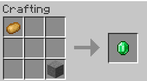
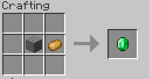

# Crafting

To create a recipe you have to create a special section in one of your `.yml` files.\
This section can be added in all and any of your `.yml` files for better organization of recipes.

## 3x3 recipe

.png>)

```yaml
info:
  namespace: myitems
recipes:
  crafting_table:
    deadmau5_hat:
      permission: myitems.deadmau5_hat
      enabled: true
      pattern:
      - BXB
      - XBX
      - XXX
      ingredients:
        B: LIGHT_BLUE_WOOL
      result:
        item: myitems:deadmau5_hat
        amount: 1
```

As you can see I created the recipes section in the .yml file, this section can contain each type of recipe.\
In this example I created a `crafting_table` recipe called `deadmau5_hat`.

## 2x2 recipe

.png>)

<figure><figcaption></figcaption></figure>

### Method 1

```yaml
taco:
  permission: itemsadder.taco
  enabled: true
  pattern:
  - XSC
  - XPB
  ingredients:
    B: itemsadder:baguette
    C: itemsadder:sliced_roast_beef
    P: itemsadder:potato_sticks
    S: itemsadder:lettuce
```

### Method 2

```yaml
taco:
  permission: itemsadder.taco
  enabled: true
  pattern:
  - SC
  - PB
  ingredients:
    B: itemsadder:baguette
    C: itemsadder:sliced_roast_beef
    P: itemsadder:potato_sticks
    S: itemsadder:lettuce
```

## Multiple patterns


You can create **multiple patterns** per recipe, just make sure that the attribute **starts** with `pattern` text. For example `pattern_2`.

```yaml
turquoise_sword:
  permission: itemsadder.turquoise_sword
  enabled: true
  pattern:
  - XRX
  - XRX
  - XSX
  pattern_2:
  - RXX
  - XXR
  - XSX
  ingredients:
    R: itemsadder:turquoise
    S: STICK
  result:
    item: itemsadder:turquoise_sword
    amount: 1
```


## Special features

```yaml
    peeled_potato:
      permission: itemsadder.peeled_potato
      enabled: true
      pattern:
      - XXX
      - XKP
      - XXX
      ingredients:
        K: itemsadder:knife
        P: POTATO
      result:
        item: itemsadder:peeled_potato
        amount: 1
      return_items:
        decrement_durability:
          knife:
            item: knife
            amount: 1
        play_sound:
          name: itemsadder:item.knife.use
          volume: 1
          pitch: 1
```

For example this is the `peeled_potato` recipe. This is a special recipe which uses a knife as ingredient of the crafting (and a potato) and decrements its durability when player crafts one peeled potato without making it disappear.

.png>)

As you can see you can also play a sound using `play_sound`.

## Shapeless recipes

```yaml
shapeless_emerald_example:
  enabled: true
  shapeless: true
  ingredients:
    A: POTATO
    B: STONE
  result:
    item: EMERALD
    amount: 1
```

<figure><figcaption></figcaption></figure>

<figure><figcaption></figcaption></figure>

## Potion type in ingredient

You can require a specific potion type in the ingredient by using the `potion_type` property, for example:

```yaml
info:
  namespace: myitems
recipes:
  crafting_table:
    infested_cobblestone:
      permission: myitems.infested_cobblestone
      enabled: true
      pattern:
        - CCC
        - CAC
        - CCC
      ingredients:
        C: COBBLESTONE
        A:
          item: POTION
          potion_type: minecraft:infested
      result:
        item: INFESTED_COBBLESTONE
        amount: 8
      return_items:
        - item: GLASS_BOTTLE
          amount: 1

```

