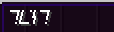

# 📎 Custom item NBT

## Adding custom NBT attributes to the item

You can specify custom **NBT** attributes to me merged into the custom item

### Example custom attribute

For example I want to merge these tags into my item.

`{my-custom-nbt-tag:"hello this is a custom tag", another-tag:"useless"}`

```yaml
items:
  custom_nbt_item:
    display_name: "Just an example"
    permission: examples.custom_nbt_item
    nbt: '{my-custom-nbt-tag:"hello this is a custom tag", another-tag:"useless"}'
    resource:
      material: DIAMOND_SWORD
      generate: true
      model_path: "minecraft:item/diamond"
    durability:
      max_custom_durability: 1324
```


#### Warning

Make sure to provide a valid **NBT** (`json`) or it won't work!


### Example custom item name

```yml
items:
  example_item_custom_name:
    enabled: true
    display_name: example_item_custom_name
    permission: custom.example_item_custom_name
    nbt: "{display:{Name:'{\"text\":\"TEST\", \"font\": \"alt\"}'}}"
```

<figure><figcaption></figcaption></figure>
