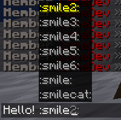

# Emojis

### Introduction

For example I want to create an emoji pack named "myemojis", so my [namespace ](broken-reference/)would be `myemojis`

### Example configurations

[https://github.com/ItemsAdder/DefaultPack/tree/main/contents/twitteremojis](https://github.com/ItemsAdder/DefaultPack/tree/main/contents/twitteremojis)

### Creating the textures folder

1. Open folder plugins\ItemsAdder\contents\\
2. Create a folder named `myemojis`
3. Create a folder named `textures`, then inside create a folder named `font` and then a folder named `emoji`
4. Now you should have this path: `ItemsAdder/contents/myemojis/textures/font/emoji/`
5. Inside this folder you have to put your emojis, you should make them 72x72 to make sure they're not too big and they're not pixelated. But you can decide the size you want (only important thing is that height and width is not over 256.
6. In this example I put an image named **smile.png**

### Creating ItemsAdder config for your emojis

1. Now you have to create the folders for your emoji configs. In this example you have to create a folder named **myemojis** inside `ItemsAdder/contents/myemojis/configs/`
2. inside of the `configs` folder create a file named **emoji\_images.yml** (you can call it whatever you want)
3. Now you have to open the .yml file and

```yaml
info:
  namespace: "myemojis"
```

Then add your emoji (in this example I made a **smile** emoji) to the list of font\_images, so your file would look like this:

```yaml
info:
  namespace: "myemojis"
font_images:
  smile:
    permission: 0
    show_in_gui: true
    path: "font/emoji/smile.png"
    scale_ratio: 9
    y_position: 8
```

**scale\_ratio** is the final height in pixels of the emoji because 72x72 pixels is too big, You'd have to scale it but you can set 9 so Minecraft will handle it automatically.\
**y\_position** is the y position in pixels, 8 should be good if you keep emoji 72x72 and scale\_ratio to 9. If you have different size you'll have to tweak the y\_position based on your tests.


`scale_ratio` must ALWAYS be bigger than `y_position` or Minecraft won't like it. I cannot fix that issue, it's a **Minecraft** limitation.


## In-game view

 (3) (1) (1) (1) (1) (1) (1) (1) (1) (1) (1) (1) (1) (1) (1) (1) (1) (1).png>)

### Using the /e useful suggestions

Write `/e` in chat, press **SPACE** and press **TAB** to start autocompleting.

.png)

.png)

.png)

### Using the tab autocomplete in chat

Write `:` in chat and press **TAB** to start autocompleting.

<figure><figcaption></figcaption></figure>
