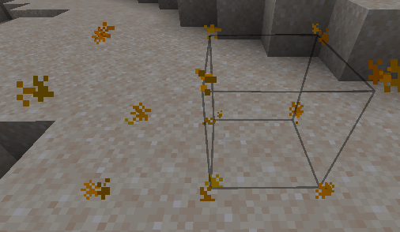

# 家具的碰撞效果

### 怎么让家具变成一个实体?

您可以通过添加一条 "solid" 属性并设定碰撞箱 "hitbox" (如果您希望它大于 1x1x1), 使家具成为一个实体

```yaml
  table:
    display_name: display-name-table
    permission: table
    lore:
      - 'lore-decorative-item'
    resource:
      material: OAK_WOOD
      generate: false
      model_path: item/table
    behaviours:
      furniture:
        small: true
        solid: true
        entity: armor_stand
        hitbox:
          length: 1
          width: 1
          height: 1
          length_offset: 0
          width_offset: 0
          height_offset: 0
```

.png>)

## 碰撞箱的位置错误 <a href="#show-the-hitbox" id="show-the-hitbox"></a>


有时候, 您还需要指定 "offset" 来修正碰撞箱子的位置.\
例如, 您的家具模型的碰撞箱为 2x1x1 就有可能发生这种情况.


### 错误的碰撞箱位置


### 正确的位置 <a href="#show-the-hitbox" id="show-the-hitbox"></a>



我需要将 width offset 设置为 0.5.\
如果需要的话，您也可以设置为负值.

```yaml
        hitbox:
          length: 1
          width: 2
          height: 1
          width_offset: 0.5
```

## 碰撞箱预览 <a href="#show-the-hitbox" id="show-the-hitbox"></a>


当您放置了一个家具时, 可以使用命令 `/iahitbox` 查看家具的碰撞箱, 这用于检测 `碰撞箱的配置错误` 十分有效.


 (2) (3) (2) (1) (1) (1) (1) (1) (1) (1) (1) (1).png>)

.png>)

.png>)


## 碰撞箱的限制

### `item_frame` 的限制 (对 `armor_stand` 不影响)

使用 `item_frame` 来制作的家具，碰撞箱中 `width` 和 `length` 的值必须相同
例如: `width: 2`, `length: 2`, `height: 1`.&#x20;

\
如果你想要使用 `width` 和 `length` 数值不同的碰撞箱 请使用：`entity: armor_stand`.


