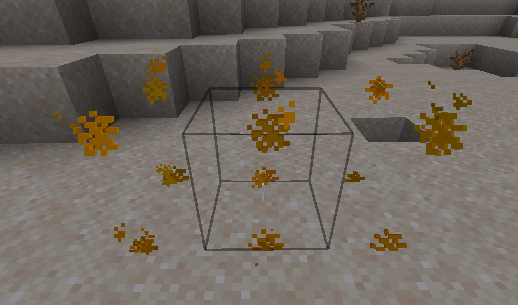

# Introduction

A furniture is a decorative object which can be solid, emit light, used as chair and can have other features.


**Limitations of all furnitures**

* non solid furnitures can't receive interact events, they can only be removed using mouse left click but cannot be interacted with (only solid furnitures can get interact events).\
  This might not be true anymore on recent game versions.
* max size of the hitbox is 3x3x3 for performance reasons


## Furniture entity types

### `item_display`

This type of furniture entity is useful for any type of furniture you want to create.

```yaml
behaviours:
  furniture:
    entity: item_display # <---
    display_transformation:
      transform: HEAD
      right_rotation:
        axis_angle:
          angle: 180
          axis:
            x: 0
            y: 1
            z: 0
      translation:
        x: 0
        y: 0.92
        z: 0
      scale:
        x: 0.45
        y: 0.45
        z: 0.45
```

#### Special properties

`item_display` allows you to do some special adjustments to your furniture model using the `display_transformation` property.\
You can resize it, rotate it and move it freely.\
This feature uses the native `item_display` feature of **Minecraft**, you can [read more here](https://www.youtube.com/watch?v=bwPWfUbcZxE) and online.\
You can also use [this tool](https://misode.github.io/transformation/) to preview your changes.

<details>

<summary>Example</summary>

```yaml
  lava_lamp_new:
    enabled: true
    display_name: display-name-lava_lamp
    permission: iadeco.decorations.lava_lamp
    lore:
      - lore-decorative-item
    resource:
      material: PAPER
      generate: false
      model_path: lava_lamp
    behaviours:
      furniture:
        entity: item_display # <---
        light_level: 7
        display_transformation:
          transform: HEAD
          right_rotation:
            axis_angle:
              angle: 180
              axis:
                x: 0
                y: 1
                z: 0
          translation:
            x: 0
            y: 0.92
            z: 0
          scale:
            x: 0.45
            y: 0.45
            z: 0.45
```

</details>

### `armor_stand`

This type of furniture entity is useful when you want to create chairs, plants, columns, lamps and similar environment decorations which don't need to rotate based on the surface on which you place them.

```yaml
behaviours:
  furniture:
    entity: armor_stand # <--- (by default, not mandatory)
    small: true
    solid: true
```

`small` allows to set the armor stand small. It will have a smaller hitbox by default and the model will look smaller.&#x20;

### `item_frame`

This type of furniture entity is useful when you want to make the furniture rotate based on the surface on which you place it.

For example if you have a decorative lamp you can make it placeable on walls, ceiling and ground and and make it oriented automatically based on the surface inclination.

.png>)

```yaml
behaviours:
  furniture:
    entity: item_frame # <--- (by default, not mandatory)
    light_level: 15
    solid: false
```

## Limit placement location

You can limit the placement of the furniture using the `placeable_on` property.

```yaml
    placeable_on:
      walls: true
      ceiling: true
      floor: true
```

## Hitbox

You can make a furniture solid adding the "solid" attribute and specifying a hitbox (if you want > 1x1x1)

```yaml
  table:
    display_name: display-name-table
    permission: table
    lore:
      - 'lore-decorative-item'
    resource:
      material: OAK_WOOD
      generate: false
      model_path: item/table
    behaviours:
      furniture:
        small: true
        solid: true
        entity: armor_stand
        hitbox:
          length: 1
          width: 1
          height: 1
          length_offset: 0
          width_offset: 0
          height_offset: 0
```

.png>)

### Hitbox has wrong location <a href="#show-the-hitbox" id="show-the-hitbox"></a>


Sometimes you need to also specify an "offset" to fix the hitbox location.\
This can happen if your furniture is 2x1x1 for example.








.png>)



### Correct location <a href="#show-the-hitbox" id="show-the-hitbox"></a>

I had to set a width `offset` of `0.5`.\
You can also use negative values if needed.

```yaml
        hitbox:
          length: 1
          width: 2
          height: 1
          width_offset: 0.5
```

## Preview the hitbox <a href="#show-the-hitbox" id="show-the-hitbox"></a>


You can use the command `/iahitbox` to see the hitbox when you place a furniture, it's very useful to detect mistakes in the hitbox configuration


 (2) (3) (2) (1) (1).png>)

.png>)


## **Hitboxes limitations**

**`item_frame` limitations (doesn't affect `armor_stand`)**

**Furnitures** that use `entity` `item_frame` **only support hitboxes** with `width` and `length` of the **same value**.\
Example: `width: 2`, `length: 2`, `height: 1`.

If you want to have different `width` and `length` use `entity` `item_display` or `armor_stand`.


## Optimization of `item_display` furniture


This requires ItemsAdder 4.0.12 or greater.


By default the plugin uses `width` and `height` of the `hitbox` to tell the game the size of the furniture render area. This is used to allow the game to hide the entity when the player is not directly looking at it and avoid overhead.

If you want you can customize this value separately using the `render_size` property.

```yaml
display_transformation:
   render_size:
      width: 3
      height: 3
```
