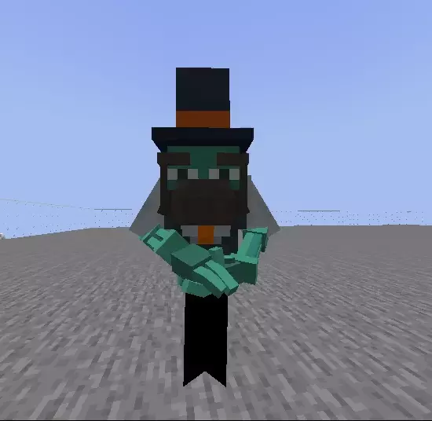

# Advanced method


This method is in beta and it's available only on ItemsAdder v3.0+



Do not abuse the spawning of these mobs.\
The plugin is very optimized but it can cause lag if you are crazy enough to spawn 600+ entities in front of a player.



Advanced animation features


### Main features

* [Blockbench](https://www.blockbench.net/) extension to convert models
* Completely Async, no TPS drops
* Optimized for big servers
* Damage animation
* Fire animation when entity is on fire
* Animate size of bones
* Animate rotation of bones without angles limitations
* Multiple mount seats
* Play sounds and particles in animations
* Show entity hands equipment
* Custom hitbox
* MythicMobs compatibility
* Citizens compatibility

### Limitations

* Head bone rotation works only if the mob head is not too far from the center of the body
* Pressing SHIFT on flying mobs to move down works only on 1.15, 1.17 and 1.18 clients as 1.16 clients have this bug: [https://bugs.mojang.com/browse/MC-202202](https://bugs.mojang.com/browse/MC-202202) .\
  1.16 clients will see players flying if they press SHIFT while on a flying entity while they should still be riding the entity.
* This plugin uses multiple entities to create the animation. \
  Network delay can cause slight animation glitches. \
  It can cause a little lag on servers if you spawn too many entities around players and if your models have too many bones.\
  (NOTE: this plugin is highly optimized so you won't get lag if your server is not a potato)
* Hitbox of Citizens NPCs can't be changed for now, it's a Citizens limitation &#x20;
