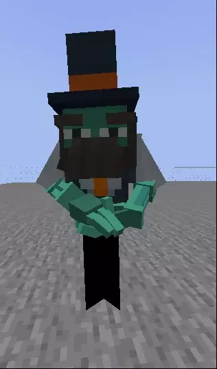

# Citizens

## Reskinning a Citizens NPC

You can use a custom model as skin for any Citizens NPC.


This plugin doesn't require Citizens to work, but some servers might need to use it to create NPCs.


### Changing the model

Set the NPC type to `ZOMBIE`: \
`/npc type ZOMBIE`


Do not use `PLAYER` as type, it causes issues with head/body rotation.


Then change the skin using the **ItemsAdder** command:\
`/iaentity citizens model <model>`\
``In this example: `/iaentity citizens model custom:barman_robot`

### Mute sounds

You can mute the NPC by using this command, more info on [Citizens wiki](https://wiki.citizensnpcs.co/Commands).\
`/npc sound -n`

### Make head rotate

You can make the NPC look at nearby players by using this command, more info on [Citizens wiki](https://wiki.citizensnpcs.co/Commands).\
`/npc look`

### Done

## Playing animation

You can play an animation using this command: `/iaentity citizens anim play <animation>`

