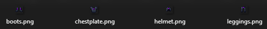
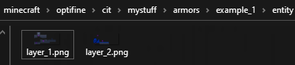
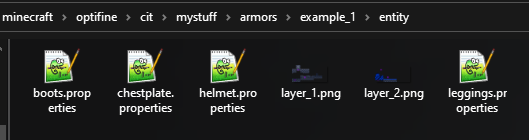

# 盔甲纹理 CIT


**Optifine** 并未被 **ItemsAdder** 官方支持，但如果你想要更多的自定义选项，可以阅读这些教程。

#### 请不要就 Optifine 功能寻求支持。谢谢！


## 1.16 及以下版本的自定义纹理盔甲

如果你想为盔甲添加自定义纹理而不仅仅是自定义颜色，你可以使用 **Optifine**。


这是一个适用于 1.16 及以下版本客户端的旧方法。\
[1.17+ 的新方法](../armors-old/textured-armor.md)不需要 **Optifine**。


## 自定义纹理盔甲

### 下载[示例插件](https://www.spigotmc.org/resources/optifine-example-custom-textured-armor-itemsadder-addon.87846/)

.png>)

.png>)

### 第一步

创建你的**自定义命名空间**（如果尚未创建），请按照[本教程](broken-reference/)操作。\
在本教程中，**我的命名空间**名为 `mystuff`

### 第二步

为**物品栏物品**创建**自定义纹理**。我将它们放在文件夹：`contents/mystuff/resourcepack/mystuff/textures/item/example_1` 中

<figure><figcaption></figcaption></figure>

### 第三步

为**穿戴中的盔甲**创建**自定义纹理**。你可以在这里获取示例：



**编辑**纹理（使用 Paint.NET、Photoshop、GIMP 或类似程序）并**保存**为 `layer_1.png` 和 `layer_2.png`

### 第四步

创建 `optifine` 文件夹，这是我们放置**穿戴中的盔甲**自定义纹理的地方：`contents/mystuff/resourcepack/minecraft/optifine/`


你**必须在** `minecraft` 文件夹下创建它，遗憾的是你**不能**在你的**命名空间**文件夹（在本例中为 `mystuff`）中创建 `optifine` 文件夹。\
这是 **Optifine 的限制**。


### 第五步

现在将**之前创建的穿戴中的盔甲**纹理（`layer_1.png` 和 `layer_2.png`）保存到此文件夹：`contents/mystuff/resourcepack/minecraft/optifine/cit/mystuff/armors/example_1/entity/`

所以你会有这样的结构：

<figure><figcaption></figcaption></figure>

### 第六步

**创建**这些文件：`boots.properties`、`chestplate.properties`、`helmet.properties`、`leggings.properties`，并放在 `contents/mystuff/resourcepack/minecraft/optifine/cit/mystuff/armors/example_1/entity/` 中

每个文件必须包含以下内容：

```elixir
nbt.itemsadder.namespace=mystuff
nbt.itemsadder.id=example_chestplate_1

type=armor
items=diamond_chestplate
texture.diamond_layer_1=layer_1
texture.diamond_layer_2=layer_2
```

对于每个 `.properties` 文件，你需要**更改第一行**，设置为**你的命名空间**而不是 "mystuff"，**第二行**设置为你的**物品 id**，**第五行**设置为**物品类型**（`diamond_leggings`、`diamond_boots` 等）

现在你应该有这样的结构：

<figure><figcaption></figcaption></figure>

### 第七步

**创建**一个**文件**来包含这个自定义盔甲，以便更好地组织它。将其命名为 **example\_1.yml** 并**放置在**你的命名空间中，在本例中为：`contents/mystuff/configs/example_1.yml`

### 第八步

**添加内容**到 `.yml` 文件中。如你所见，我决定基于 Minecraft 的钻石盔甲，并且我没有指定任何颜色，因为我不需要为其着色，Optifine 会为其应用纹理。

```yaml
info:
  namespace: mystuff
items:
  example_helmet_1:
    display_name: Example
    permission: example_helmet_1
    resource:
      generate: true
      material: DIAMOND_HELMET
      textures:
      - item/example_1/helmet.png
    durability:
      max_custom_durability: 275
    specific_properties:
      armor:
        slot: head
    attribute_modifiers:
      head:
        armor: 9
        armorToughness: 1
  example_chestplate_1:
    display_name: Example
    permission: example_chestplate_1
    resource:
      generate: true
      material: DIAMOND_CHESTPLATE
      textures:
      - item/example_1/chestplate.png
    durability:
      max_custom_durability: 400
    specific_properties:
      armor:
        slot: chest
    attribute_modifiers:
      chest:
        armor: 7
        armorToughness: 1
  example_leggings_1:
    display_name: Example
    permission: example_leggings_1
    resource:
      generate: true
      material: DIAMOND_LEGGINGS
      textures:
      - item/example_1/leggings.png
    durability:
      max_custom_durability: 375
    specific_properties:
      armor:
        slot: legs
    attribute_modifiers:
      legs:
        armor: 5
        armorToughness: 1
  example_boots_1:
    display_name: Example
    permission: example_boots_1
    resource:
      generate: true
      material: DIAMOND_BOOTS
      textures:
      - item/example_1/boots.png
    durability:
      max_custom_durability: 325
    specific_properties:
      armor:
        slot: feet
    attribute_modifiers:
      feet:
        armor: 3
        armorToughness: 1
```

## 完成！

## 注意事项：


如果你**创建了另一个包含其他盔甲的命名空间**，强烈建议**保持**与本教程中相同的**结构**以**避免错误**。

\
例如，如果你创建了一个名为 `space_armors` 的新命名空间，你将拥有这样的 **Optifine** 文件夹：`contents/mystuff/resourcepack/minecraft/optifine/cit/space_armors/armors`

