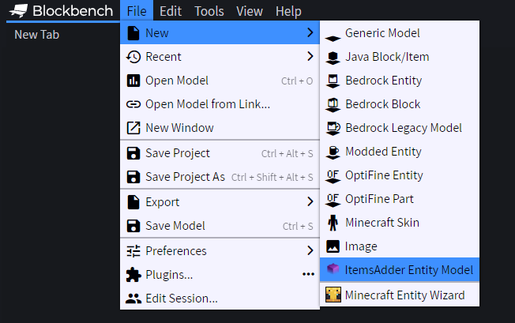
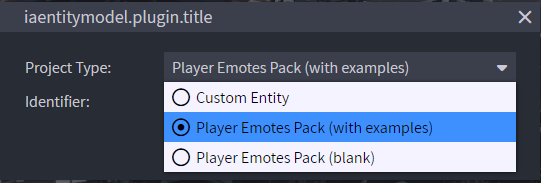
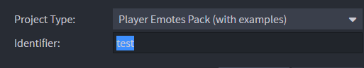
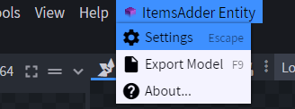
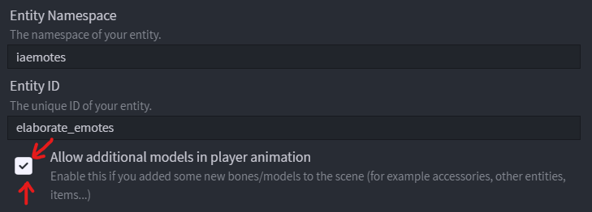
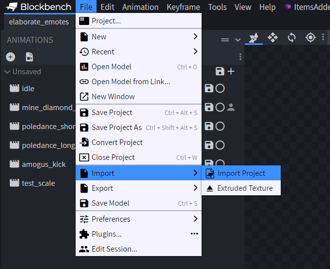
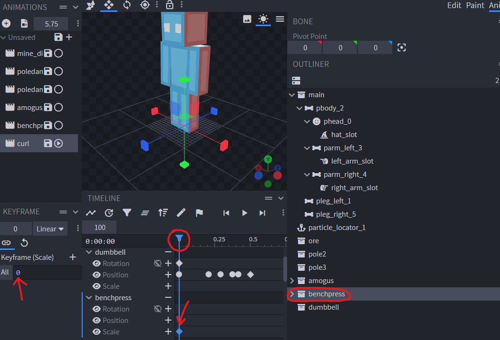

# Animations

## Opening the animations editor

Create a new "`ItemsAdder Entity Model`".\
You can create as many as animations files you want.

<figure><figcaption></figcaption></figure>

Decide if you want to create an emotes file with examples or a blank emotes file.

<figure><figcaption></figcaption></figure>

Decide a name for your emotes pack.

<figure><figcaption></figcaption></figure>

You can notice a lot of example animations on the left.

.png>)

Delete all the emotes and edit/rename the ones you want. \
They are useful only as base for your new emotes, to have an example to learn from.

.png>)

You can animate your models normally, like you would do with normal Blockbench models.\
You can find a lot of tutorials on YouTube.



When you are finished, save your `.iaentitymodel` project file into this folder (change `my_emotes` to your namespace, this one is an example):\
`ItemsAdder/contents/my_emotes/`

<figure><figcaption></figcaption></figure>

Then continue following the tutorial to know how to export the emotes into ItemsAdder.

### Apply the changes to ItemsAdder

Click on the **ItemsAdder** tab and press **Export**.

.png>)

You should get a success message.

.png>)


If you didn't add any custom model into your emote there is <mark style="color:green;">no need</mark> to use `/iazip`!\
Use the command `/iareload` to load the new animation in the game.


## Playing the animations

Use the emote command: `/iaemote <emote> [player]` or `/emote <emote> [player]`

## Emote permission

Use the `/iaemote` command: `ia.user.iaemote`

Use an emote: `ia.user.iaemote.use.<emote>`\
Example: `ia.user.iaemote.use.yes`

### More info about permissions


[permissions.md](../../permissions.md)


### Showcase of some examples





### Here you can download an example project:



You can add custom models to your emotes, for example: items, monsters, furniture, animated effects.

### Important


This requires ItemsAdder 3.5.0 or greater.

* DO NOT delete any built-in player bone.
* DO NOT resize any built-in player bone, it simply won't work ingame.
* Edit built-in player bones only in the animation view (rotate, move).
* You can hide the built-in player bones using scale to `0,0,0`. Set to `1,1,1` to show them again.


### Different type of emotes

* `.player_advanced_animations` file format is now used to identify player animations which also add custom models to the emote.
* `.player_animations` are the player animations which don't add any custom model but will be loaded into the default player model.

In order to decide that you have to set this option in the **Blockbench** extension settings.

<figure><figcaption></figcaption></figure>

### Importing elements into the scene

You can import any `.bbmodel` into the scene and use it in your animation.\
You can also import extruded textures to show items dynamically.

<figure><figcaption></figcaption></figure>

### Hiding unused elements in other animations of the game `.iaentitymodel` emotes file

1. select the animation
2. select the element you want to hide for a particular animation
3. move to the first frame of the animation, using the timeline
4. create a new scale key, make sure to set it to the first keyframe
5. set scale to 0

Now your model won't be shown for this particular animation.\
You can show/hide it in the middle of the animation just by doing the same thing but setting scale to 1.

<figure><figcaption></figcaption></figure>

## Lock the player movement

You can specify if the player can move while playing one specific animation or not.

.png>)

## Looping animations

You can create animations which would play `start` -> `loop` -> `end` sub-animation.\
This allows you to create complex looping animations, for example a sleep animation where your player would lay and stay there until the player presses SHIFT.

### Step 1

Create the animation, in this example a death animation.

.png>)

Right click it and mark it as `Loop`.

.png>)

### Step 2

Now place the cursor on the frame where you want the loop to start, in this case when the player is on the ground.

.png>)

### Step 3

Click on the `Add Loop Start/End marker` icon to add a `start loop` marker.

.png>)

Now place the animation cursor on the frame where you want the loop to stop and press again on the `Add Loop Start/End marker` icon.

.png>)

The result will be like this:

.png>)
