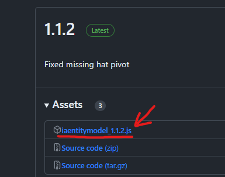

# 创建

## 安装 Blockbench 拓展


**继续之前：**

* 确保你运行的是 **Blockbench 4.7.4** 或更高版本
* 确保你运行的是最新的 ItemsAdder 和最新的 ItemsAdder Blockbench 扩展


[下载 Blockbench](https://www.blockbench.net/)（不要使用网页版）。

 (1).png>)

\
[下载](https://github.com/LoneDev6/itemsadder-entity/releases) 扩展文件。

<figure><figcaption></figcaption></figure>

然后打开 **Blockbench** 并点击 File -> Plugins。

 (1) (1).png>)

点击图标从文件加载插件，然后选择文件 `iaentitymodel.js`。

 (1) (1).png>)

按 OK

.png>)

## 启用表情

打开 ItemsAdder 的 `config.yml` 并启用这两个选项，然后运行 `/iazip` 命令。


```yaml
entities:
  custom-entitites:
    enabled: true
    emotes: true
```


## 打开动画编辑器

创建一个新的 "`ItemsAdder Entity Model`"

你可以创建任意数量的动画文件（**ItemsAdder 3.2.1+**）。

<figure><figcaption></figcaption></figure>

决定是否要创建带有示例的表情文件或空白表情文件。

<figure><figcaption></figcaption></figure>

为你的表情包决定一个名称。

<figure><figcaption></figcaption></figure>

你可以在左侧看到很多示例动画。

 (3).png>)

删除所有表情并编辑/重命名你想要的。\
它们仅作为你新表情的基础，提供一个学习的示例。

.png>)

现在创建一个新的动画（表情）并将你的 `.iaentitymodel` 项目文件保存到此文件夹中（将 `my_emotes` 更改为你的命名空间，这是一个示例）：\
`ItemsAdder/contents/my_emotes/resourcepack/`

.png>)

然后继续按照教程了解如何将表情导出到 ItemsAdder。

### 将更改应用到 ItemsAdder

点击 **ItemsAdder** 选项卡并按 **Export**。

.png>)

你应该会收到成功消息。

 (1).png>)


如果你没有在表情中添加任何自定义模型，则<mark style="color:green;">不需要</mark>使用 `/iazip`！\
使用命令 `/iareload` 在游戏中加载新动画。


## 播放动画

使用表情命令：`/iaemote <emote> [player]` 或 `/emote <emote> [player]`

## 表情权限

使用 `/iaemote` 命令：`ia.user.iaemote`

使用表情：`ia.user.iaemote.use.<emote>`\
示例：`ia.user.iaemote.use.yes`

### 更多权限信息


[权限列表](../../permissions.md)


## 在表情中添加自定义模型

### 一些示例的展示





### 这里你可以下载一个示例项目：



你可以向表情添加自定义模型，例如：物品、怪物、家具、动画效果。

### 重要


这需要 ItemsAdder 3.5.0 或更高版本。

* 不要删除任何内置的玩家骨骼。
* 不要调整任何内置的玩家骨骼的大小，它在游戏中不会起作用。
* 仅在动画视图中编辑内置的玩家骨骼（旋转、移动）。
* 你可以使用缩放将内置的玩家骨骼设置为 `0,0,0` 以隐藏。设置为 `1,1,1` 以显示。


### 不同类型的表情

* `.player_advanced_animations` 文件格式现在用于标识也向表情添加自定义模型的玩家动画。
* `.player_animations` 是不添加任何自定义模型，但会加载到默认玩家模型中的玩家动画。

为了决定这一点，你需要在 **Blockbench** 扩展设置中设置此选项。

[](https://user-images.githubusercontent.com/27242001/244145963-c9ca9a77-bb79-4804-92e4-8708eac41517.png)

<figure><figcaption></figcaption></figure>

### 将元素导入场景

你可以将任何 `.bbmodel` 导入场景并在动画中使用它。\
你还可以导入特别的纹理以动态显示物品。

<figure><figcaption></figcaption></figure>

### 在游戏的 `.iaentitymodel` 表情文件中隐藏未使用的元素

1. 选择动画
2. 选择要为特定动画隐藏的元素
3. 使用时间轴移动到动画的第一帧
4. 创建一个新的缩放关键帧，确保将其设置为第一个关键帧
5. 设置缩放为 0

现在你的模型不会在这个特定动画中显示。\
你可以通过执行相同的操作但将缩放设置为 1 来在动画中间显示/隐藏它。

<figure><figcaption></figcaption></figure>
