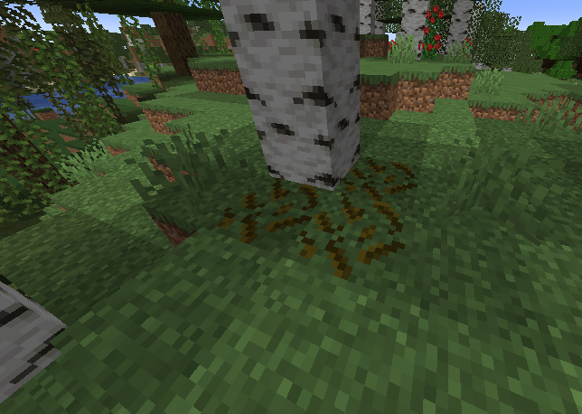

# 表面生成器

## 在世界表面生成装饰

使用 ItemsAdder，您可以在世界各地生成装饰，使您的服务器更加专业和独特。

例如，您可以制作新的蘑菇、小植物、岩石和装饰品。




## 创建表面生成器

### 创建配置

例如，让我们创建一个将在世界各地生成的玫瑰。

```yaml
info:
  namespace: myitems
surface_decorators:
  rose:
    block: rose
    bottom_blocks:
    - DIRT
    - GRASS_BLOCK
    biomes:
    - PLAINS
    - SUNFLOWER_PLAINS
    - RIVER
    - MOUNTAINS
    - MOUNTAIN_EDGE
    - BIRCH_FOREST
    - BIRCH_FOREST_HILLS
    - TALL_BIRCH_FOREST
    - TALL_BIRCH_HILLS
    worlds:
      - world
    chance: 10
    max_height: 255 
    min_height: 0
    amount: 1
```

正如您所看到的，我设置了一些属性：

`block` 是要生成为装饰的 ItemsAdder 方块。

`bottom_blocks` 属性用于决定装饰可以生成的方块类型。

`biomes` 属性用于决定装饰可以生成的有效生物群系。

`worlds` 属性决定装饰可以生成的世界。

`chance` 是每个世界区块中生成装饰的几率。

`max_height` 是装饰可以生成的最大世界高度。

`min_height` 是装饰可以生成的最小世界高度。

`amount` 是装饰组中要生成的方块的数量，例如，您可以设置为 5 以使一组 5 个装饰生成在一起。

## 创建方块

现在，您只需按照教程创建方块。您可以根据需要使用 `REAL_NOTE`、`REAL_WIRE`、`REAL_TRANSPARENT` 和 `REAL` 方块。


[创建方块](block.md)


## 示例

您可以在此处下载完整的工作插件：




