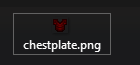
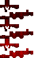

# 盔甲纹理

这里你可以看到一个创建具有自定义穿戴纹理（在身体上）的完整盔甲的示例配置。

## 完整的最终 `yml` 配置

<details>

<summary>点击这里查看配置文件</summary>

```yaml
info:
  namespace: myitems
armors_rendering:
  myarmor:
    color: "#d60000"
    layer_1: armor/myarmor/layer_1
    layer_2: armor/myarmor/layer_2
items:
  myarmor_helmet:
    display_name: myarmor helmet
    permission: myarmor
    resource:
      generate: true
      textures:
      - item/myarmor/helmet
    durability:
      max_custom_durability: 275
    specific_properties:
      armor:
        slot: head
        custom_armor: myarmor
    attribute_modifiers:
      head:
        armor: 9
        armorToughness: 1
  myarmor_chestplate:
    display_name: myarmor chestplate
    permission: myarmor
    resource:
      generate: true
      textures:
      - item/myarmor/chestplate
    durability:
      max_custom_durability: 400
    specific_properties:
      armor:
        slot: chest
        custom_armor: myarmor
    attribute_modifiers:
      chest:
        armor: 7
        armorToughness: 1
  myarmor_leggings:
    display_name: myarmor leggings
    permission: myarmor
    resource:
      generate: true
      textures:
      - item/myarmor/leggings
    durability:
      max_custom_durability: 375
    specific_properties:
      armor:
        slot: legs
        custom_armor: myarmor
    attribute_modifiers:
      legs:
        armor: 5
        armorToughness: 1
  myarmor_boots:
    display_name: myarmor boots
    permission: myarmor
    resource:
      generate: true
      textures:
      - item/myarmor/boots
    durability:
      max_custom_durability: 325
    specific_properties:
      armor:
        slot: FEET
        custom_armor: myarmor
    attribute_modifiers:
      feet:
        armor: 3
        armorToughness: 1
```

</details>


将 zip 文件解压到 ItemsAdder 的 `contents` 文件夹中 


## 自定义装备纹理


`vanilla` 功能需要 Minecraft 1.17 或更高版本。\
它不能在 Minecraft 1.16 及之前的版本中工作。

为了让 1.16 客户端看到自定义盔甲，你可以启用 `optifine` 属性，这将允许旧客户端仍然看到盔甲。

这对于使用与自定义盔甲原版着色器不兼容的自定义着色器的人来说也是一个有用的备选。



如果你看到了**错误**纹理，并且使用了 **Optifine**，请[阅读此处](../../faq/armors-textures-not-working-with-shaders-mod.md)。


### 创建盔甲着色器


盔甲着色器是一种设置，包含了如何在游戏中显示盔甲在玩家身体上的信息。\
它是一个配置，指定了游戏如何在游戏中显示盔甲。

注意：每种颜色只能有一个盔甲着色器。


```yaml
info:
  namespace: my_items
armors_rendering:
  custom_armor:
    color: "#d60000"
    layer_1: armor/my_armor/layer_1
    layer_2: armor/my_armor/layer_2
    use_color: false
```


你必须决定一个颜色！即使盔甲不会被着色。颜色就像是自定义盔甲着色器的 ID（标识符）。


* `use_color: false` 禁用了使用指定 `color: "#d60000"` 对盔甲进行重新着色。如果设置为 `true`，它会对盔甲纹理进行着色。
在某些情况下，你可能希望使用指定的 `color` 对盔甲进行重新着色，所以你需要将其设置为 `true`。
* `color` 是该盔甲的颜色属性。
它充当盔甲的唯一标识符（如果 `use_color` 为 `true`，则会对盔甲进行着色）。使用这个[网站](https://minecraftcommand.science/armor-color)获取有效颜色。

注意：如果所选颜色已被另一个自定义盔甲使用，ItemsAdder 将自动选择一个最接近的未使用颜色。

Now I create the two PNG files inside the `contents/my_items/textures/armor/my_armor/` folder.

<figure><figcaption></figcaption></figure>


**高清盔甲纹理**

你也可以创建高清高分辨率盔甲！\
只需确保它们具有与原始盔甲相同的比例。\
例如:\
64x32, 128x64, 256x128, 512x256... <mark style="color:red;">重要！必须为2的幂数。</mark>



不建议使用高清纹理，因为这是一个方块游戏。\
大量高清纹理可能会导致问题，因为每个显卡的尺寸限制不同。

所以如果你想避免风险，最好坚持使用原版纹理尺寸。


### 创建盔甲部件

让我们创建一个胸甲。\
要创建其他部件，你只需重复以下方法并更改 `slot`。

```yaml
  my_armor_chest:
    display_name: my_armor chestplate
    permission: my_armor
    resource:
      generate: true
      textures:
      - item/my_armor/chestplate
    durability:
      max_custom_durability: 400
    specific_properties:
      armor:
        slot: chest
        custom_armor: my_armor
    attribute_modifiers:
      chest:
        armor: 7
        armorToughness: 1
```


确保未设置`material` 属性。这是由插件自动处理的。如果设置了该属性，则该防具不会生效。


`custom_armor` 属性很重要，它使插件将之前的 `armors_renderer` 设置应用于这个盔甲部件。

在这种情况下，我没有在盔甲部件的 `specific_properties` 字段中指定任何 `color`，因为它会自动由 `custom_armor` 属性应用，继承自 `armors_renderer`。

现在我创建物品纹理并将其放入文件夹中：
`contents/my_items/textures/item/my_armor/`

在这个例子中，我还创建了一个名为 `my_armor` 的新文件夹，以更好地组织资源包，因为你将为每个盔甲部件拥有 1 个纹理，将它们放在同一个纹理文件夹中可能会导致混淆。

`contents/my_items/textures/item/my_armor/chestplate.png`



 (1) (1).png>)

### 动画纹理

你也可以创建动画盔甲！

 (1).gif>)

要创建动画盔甲，你需要创建一个包含所有动画帧的图像。\
每个帧必须在前一个帧的下方。这是示例，一个 3 帧动画：




现在让我们编辑渲染属性以支持动画。

```yaml
info:
  namespace: my_items
armors_rendering:
  my_armor:
    color: "#d60000"
    layer_1: armor/my_armor/layer_1
    layer_2: armor/my_armor/layer_2
    use_color: false
    animation:
      interpolation: true
```

在这种情况下，我设置 `interpolation: true`，因为我希望动画是平滑的。

默认速度是 24，但你可以自定义它，直到找到合适的速度值：

```yaml
    animation:
      speed: 30
      interpolation: true
```

### 发光纹理（在黑暗中发光

你也可以创建在黑暗中发光的发光纹理。（你可以同时制作动画和发光纹理！）

```yaml
info:
  namespace: my_items
armors_rendering:
  my_armor:
    color: "#d60000"
    layer_1: armor/my_armor/layer_1
    layer_2: armor/my_armor/layer_2
    emissive_1: armor/my_armor/emissive_1
    emissive_2: armor/my_armor/emissive_2
    use_color: false
```

在这种情况下，我想让之前的动画发光，在黑暗中发光。
你需要制作 2 个纹理以使纹理发光。
**透明**部分**不会发光**，而有色部分会发光。

你基本上只需复制并粘贴你的纹理并擦除你不想发光的部分。

## 自定义 3D 头盔

由于 Minecraft 的限制，当前仅物品装备至头部时支持 3D。

这是一个如何创建带有 3D 模型而非仅纹理的头盔示例。

```yaml
info:
  namespace: my_items
items:
  test_3d_helmet:
    display_name: Test 3D Helmet
    resource:
      generate: false
      model_path: item/test_3d_helmet
      material: PAPER
    durability:
      max_durability: 1562
    behaviours:
      hat: true
```


确保使用诸如`PAPER` 的`material`，而非一个真正的头盔，否则模型会在装备时不可见。



自定义头盔的耐久设置，仅在 ItemsAdder 4.0.8+ 支持。
