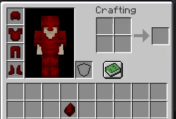

# טקסטורה


התכונה `vanilla_1_17` דורשת ItemsAdder 2.4.22+ ו-Minecraft 1.17.\
זה לא יכול לעבוד על Minecraft 1.16 וגרסאות קודמות.\
כדי לגרום לטקסטורה 1.16 להראות את הארמור המיוחד אתם יכולים להפעיל גם את התכונה 'optifine', זה יאפשר לשחקנים מגרסאות ישנות לראות את הארמור בכל מקרה.



אם אתם רואים טקסטורות **פגומות** והתקנתם **Optifine** בבקשה [קראו כאן](../../../faq/armors-bugs/textures-broken-by-shaders-mod.md).


## יצירת רנדר לארמור


מעבד\רנדר הארמור הוא הגדרה המכילה מידע כיצד להציג את הארמור במשחק על גוף השחקן.

הערה: יכול להיות רק עיבוד ארמור אחד לכל צבע.


```yaml
info:
  namespace: myitems
armors_rendering:
  my_armor:
    color: "#d60000"
    layer_1: armor/my_armor/layer_1
    layer_2: armor/my_armor/layer_2
    use_color: false
```

זה הוא קובץ ההגדרה שמפרט כיצד המשחק יציג את הארמור במשחק.


אתם חייבים להחליט על צבע! גם אם הארמור לא יהיה צבעוני. הצבע הוא כמו מז ה עבור המערכת שמעבדת הארמור שאתם יוצרים.


הפוקצייה `use_color` משביתה את הצביעה מחדש של הארמור באמצעות `הצבע שצוין: "#d60000"`. במקרים מסוימים ייתכן שתרצו לצבוע מחדש את הארמור באמצעות ה'צבע' שצוין, אז תצטרכו להגדיר אותו ל'true'. \*\*\*\* אפשרות זו גם תגרום לפריט (באינבטורי) לא להיצבע יותר אוטומטית.

התכונה 'color' היא תכונת הצבע של שריון זה. הוא פועל כמזהה ייחודי עבור השריון (ויגוון את השריון אם 'use\_color' הוא מוגדר ל 'true'). השתמשו באתר זה כדי לקבל צבע תקף: [https://minecraftcommand.science/armor-color](https://minecraftcommand.science/armor-color)

כעת אני יוצר את שני קבצי PNG בתוך התיקיה `data/resource_pack/assets/myitems/textures/armor/my_armor/`.

.png>)


#### טקסטורות ארמור HD

אתם יכולים ליצור גם ארמורים HD ברזולוציה גבוהה!

רק וודאו שיש להם את אותן פרופורציות של המקור. לדוגמה 64x32, 128x64, 256x128, 512x256..... <mark style="color:red;">זה מאוד חשוב! הגודל חייב להיות חזק של 2.</mark>


### יצירת חתיכת ארמור

לדוגמה, בואו ניצור ארמור "חזה"(את שאר החלקים תעשו לבד, לפי אותה שיטה).

```yaml
  my_armor_chestplate:
    display_name: "My Armor Chestplate"
    permission: my_armor_chestplate
    resource:
      generate: true
      textures:
      - item/my_armor/chestplate
    durability:
      max_custom_durability: 602
    specific_properties:
      armor:
        slot: chest
        custom_armor: my_armor
    attribute_modifiers:
      chest:
        armor: 8
        armorToughness: 3
```

המאפיין `custom_armour` חשוב, הוא גורם לתוסף להשתמש בהגדרת הטקסטורות הקודמת (`armors_renderer`) עבור חתיכת הארמור הזאת.

במקרה זה, לא ציינתי שום 'color' בשדה 'specific\_properties' של ה-חתיכת ארמור כי הוא כבר צוין במאפיין 'custom\_armour'.

כעת אני יוצר את טקסטורת הפריט ואז אני שם אותו בתוך תיקיית `data\resource_pack\assets\myitems\textures\item\my_armor\` (בדוגמה זו יצרתי גם תיקיה חדשה בשם `my_armor` כדי לארגן טוב יותר את חבילת המשאבים).

.png>)

.png>)

### טקסטורות מונפשות (אנימציות)

אתם גם יכולים ליצור ארמור אם אנימציות!



כדי ליצור ארמור מונפש יש ליצור תמונה עם כל הפריימים של האנימציה.

כל מסגרת חייבת להיות מתחת לקודמת. זו דוגמה זו אנימציה של 3 פריימים:

.png>)


כעת נערוך את מאפייני הרינדור כדי לתמוך בהנפשה.

```yaml
info:
  namespace: myitems
armors_rendering:
  my_armor:
    color: "#d60000"
    layer_1: armor/my_armor/layer_1
    layer_2: armor/my_armor/layer_2
    use_color: false
    animation:
      interpolation: true
```

במקרה הזה אני מגדיר 'interpolation: true' כי אני רוצה שהאנימציה תהיה חלקה.

מהירות ברירת המחדל היא 24, אבל אתה יכול להתאים אותה עד שתמצא את ערך המהירות הנכון:

```yaml
    animation:
      speed: 30
      interpolation: true
```

### מרקמים פולטים (זוהרים בחושך)

אתם יכולים גם ליצור טקסטורות ארמור שזוהרות בחושך. (אתם יכולים ליצור גם אנימציה וגם טקסטורות זוהרות בו-זמנית!)

```yaml
info:
  namespace: myitems
armors_rendering:
  my_armor:
    color: "#d60000"
    layer_1: armor/my_armor/layer_1
    layer_2: armor/my_armor/layer_2
    emission_1: armor/my_armor/emission_1
    emission_2: armor/my_armor/emission_2
    use_color: false
```

במקרה הזה אני רוצה להפוך את האנימציה הקודמת לזוהרת, אני רוצה שהיא תאיר בחושך.\
יש להכין 2 טקסטורות על מנת לגרום להם להאיר.\
החלק **השקוף** **לא יאיר** ואילו החלק הצבעוני יאיר.

אתם בעצם רק צריכים להעתיק ולהדביק את הטקסטורה שלכם ולמחוק את החלקים שאתם לא רוצים שיזהרו.
