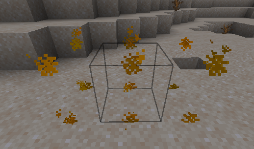

# Furniture collisions

### How can I make a furniture solid?

You can make a furniture solid adding the "solid" attribute and specifying a hitbox (if you want > 1x1x1)

```yaml
  table:
    display_name: display-name-table
    permission: table
    lore:
      - 'lore-decorative-item'
    resource:
      material: OAK_WOOD
      generate: false
      model_path: item/table
    behaviours:
      furniture:
        small: true
        solid: true
        entity: armor_stand
        hitbox:
          length: 1
          width: 1
          height: 1
          length_offset: 0
          width_offset: 0
          height_offset: 0
```

.png>)

## Hitbox has wrong location <a href="#show-the-hitbox" id="show-the-hitbox"></a>


Sometimes you need to also specify an "offset" to fix the hitbox location.\
This can happen if your furniture is 2x1x1 for example.


### Wrong hitbox location



### Correct location <a href="#show-the-hitbox" id="show-the-hitbox"></a>


I had to set a width offset of 0.5.\
You can also use negative values if needed.

```yaml
        hitbox:
          length: 1
          width: 2
          height: 1
          width_offset: 0.5
```

## Preview the hitbox <a href="#show-the-hitbox" id="show-the-hitbox"></a>


You can use the command `/iahitbox` to see the hitbox when you pleace a furniture, it's very useful to detect mistakes in the hitbox configuration


 (2) (3) (2) (1).png>)

.png>)

.png>)


## Hitboxes limitations

### `item_frame` limitations (doesn't affect `armor_stand`)

**Furnitures** that use `entity: item_frame` **support only hitbox** with `width` and `length` of the **same value**. \
Example: `width: 2`, `length: 2`, `height: 1`.&#x20;

\
If you want to have different `width` and `length` use `entity: armor_stand`.


