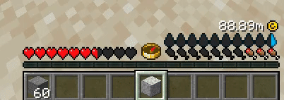

# ממשק משתמש משלכם (קשה)

## What is a CUSTOM HUD?

A custom HUD is a hud with the `type: CUSTOM` set.

This special type gives you total control over how the HUD will work. No image is specified in the YML file and you can avoid creating the `player_stat_name`.


Warning:

This type of HUD requires you to use the [Java API](broken-reference) and know how to code in Java.



[Broken link](broken-reference)


## Examples



