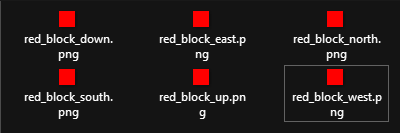

# My First Block


### **Resourcepack hosting**

Remember to **decide** a [**resourcepack hosting**](../resourcepack-hosting/) method **before** you **start**.\
I **advise** you to use **self-host** which is **easier** and **faster**, but you can also use **Dropbox** and similar\\


### Configuration file


This is an example block (remember to change `myitems` namespace to the one you want).


For example I created a **file** which will contain all my **custom blocks.**\
I created it in the folder: `contents/myitems/configs/`

I start creating a simple block called `red_block` in the file `blocks.yml`**.**&#x20;


```yaml
info:
  namespace: myitems
items:
  red_block:
    display_name: Red Block
    permission: red_block
    resource:
      material: PAPER
```



It's very important to use a **non placeable** vanilla **material**. For example **`PAPER`**.\
If you use a block (like `STONE` or `DIRT`) it will result a bit glitchy when placed.


### Creating the textures files

To do that you have to put the `.png` textures file inside the correct folder.

In this case your **namespace** is `myitems` so you have to put them in this folder:\
`contents/myitems/textures/block/`

<details>

<summary>Alternative textures location</summary>

Alternatively you can put them in this folder too:\
`contents/myitems/resourcepack/assets/myitems/textures/block/`

Read more here: [folders structure](configs-and-resourcepack.md#why-different-folder-structures-choices)

</details>

<figure><figcaption></figcaption></figure>

### Applying the textures files to your item

Now open `blocks.yml` file again and add the `resource` part as I did.\
As you can see I set `generate: true` and I set the textures for the item.\
This tells the plugin to generate the 3D model automatically using your texture.

```yaml
info:
  namespace: myitems
items:
  red_block:
    display_name: Red Block
    permission: red_block
    resource:
      generate: true
      material: PAPER
```

### Using different texture for each face


**Important**: keep the correct cardinal directions order as shown in the example.


```yaml
info:
  namespace: myitems
items:
  red_block:
    display_name: Red Block
    permission: red_block
    resource:
      generate: true
      material: PAPER
      textures:
        - block/red_block_down.png
        - block/red_block_east.png
        - block/red_block_north.png
        - block/red_block_south.png
        - block/red_block_up.png
        - block/red_block_west.png
```

### Using the same texture for each face

```yaml
info:
  namespace: myitems
items:
  red_block:
    display_name: Red Block
    permission: red_block
    resource:
      generate: true
      material: PAPER
      texture: block/red_block.png
```

### Adding the block placing functionality

You have to add the `specific_properties` attribute.

```yaml
info:
  namespace: myitems
items:
  red_block:
    display_name: Red Block
    permission: red_block
    resource:
      generate: true
      material: PAPER
      texture: block/red_block.png
    specific_properties:
      block:
        placed_model:
          type: REAL_NOTE
          break_particles: ITEM
```

## Getting the block ingame

Run `/iaget red_block` to get the item.

.png>)

.png>)

.png>)

## Download the complete example



## Block loot

```yaml
info:
  namespace: myitems
items:
  red_block:
    display_name: Red Block
    permission: red_block
    resource:
      generate: true
      material: PAPER
      texture: block/red_block.png
    specific_properties:
      block:
        drop_when_mined: false # IMPORTANT! To avoid duplication
        placed_model:
          type: REAL_NOTE
          break_particles: ITEM
          

loots: # Here the custom loots list
  blocks:
    ruby_ore: # Here your custom block loot
      type: myitems:red_block
      biomes:
        - PLAINS
        - SUNFLOWER_PLAINS
        - MOUNTAINS
      items:
        drop1: # Here the dropped item
          item: DIAMOND
          min_amount: 1
          max_amount: 2
          chance: 100 # Percentage
```

