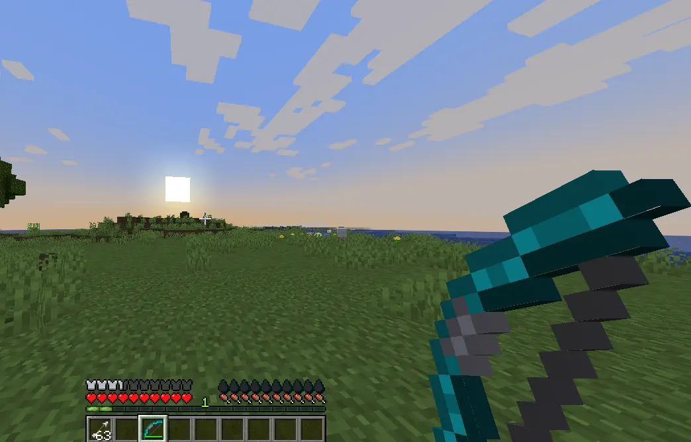

# My First Bow


### **Resourcepack hosting**

Remember to **decide** a [**resourcepack hosting**](../resourcepack-hosting/) method **before** you **start**.\
I **advise** you to use **self-host** which is **easier** and **faster**, but you can also use **Dropbox** and similar



It is very important to set the textures/models to your bow item correctly, or you will get missing texture.




## Bow with `.png` images

### Configuration file


```yaml
info:
  namespace: myitems
items:
  my_bow:
    enabled: true
    name: My Bow
    resource:
      material: BOW
      generate: true
      texture: item/my_bow.png
```


### Texture files

The bow animates as you pull it, this allows you to have a single texture for each of these states.

`contents/myitems/textures/item/`

<div align="left"><figure><figcaption></figcaption></figure></div>

* `_0` - First pulling state
* `_1` - Second pulling state
* `_2` - Third pulling state

<figure><figcaption></figcaption></figure>

## Bow with 3D `.json` models

### Configuration file


```yaml
info:
  namespace: myitems
items:
  my_3dbow:
    enabled: true
    name: My 3D Bow
    resource:
      material: BOW
      generate: false
      model_path: item/my_3dbow
```


### Models files

`contents/myitems/models/item/`


<div align="left"><figure><figcaption></figcaption></figure></div>

* `_0` - First pulling state
* `_1` - Second pulling state
* `_2` - Third pulling state

Open your models files and update the textures paths. As you can see I updated the namespace.

<figure><figcaption></figcaption></figure>

Move your textures into the correct namespace, in this case `myitems`.

`contents/myitems/textures/item/`

<figure><figcaption></figcaption></figure>

<figure><figcaption></figcaption></figure>
