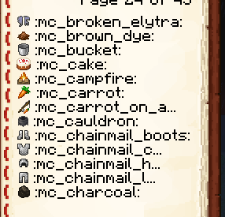
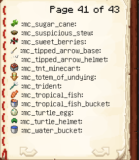

# iaimage

Cette commande vous permet de voir une liste de toutes les images de police (comme les emojis) disponibles pour être utilisées dans le chat, les commandes, les panneaux et les livres.

## Personnalisation des livres

Vous pouvez personnaliser certaines parties du livre affiché avec cette commande.


Nécessite ItemsAdder 3.4.0b ou version ultérieure.


### Changer la police du livre en police par défaut de Minecraft (option par défaut du plugin)

```yaml
  iaimage-book:
    max-line-length: 18
    placeholder-font: "minecraft:default"
```

Il est conseillé de définir `max-line-length: 18`, ce qui permet aux textes longs d'utiliser tout l'espace disponible sur la ligne.

<figure><figcaption></figcaption></figure>

### Changer la police du livre en police fine de Minecraft

```yaml
  iaimage-book:
    max-line-length: 22
    placeholder-font: "uniform"
```

Il est conseillé de définir `max-line-length: 22`, ce qui permet aux textes longs d'utiliser tout l'espace disponible sur la ligne.\
Le plugin doit éviter que des textes trop longs ne débordent et ne passent à la ligne suivante, mais si cela se produit, vous devrez réduire la valeur de longueur à `20` ou moins.

<figure><figcaption></figcaption></figure>