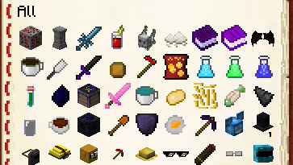

# First Install


**Make sure** that all of your plugins and server software are up to date!\
**Always check** the version of ItemsAdder you are downloading!

* <mark style="color:red;">**v3 is only for 1.20.4 and lower**</mark>
* <mark style="color:red;">**v4 is only for 1.20.6 and greater**</mark>




#### Installing the plugin and libraries

Click here to read v3 installation

* Stop the server.

- Put **ProtocolLib** JAR inside the `plugins` folder
  * Download 1.21.4 and older versions [here](https://github.com/dmulloy2/ProtocolLib/releases/)

* Put [**LoneLibs**](https://www.spigotmc.org/resources/lonelibs.75974/) JAR inside the `plugins` folder (not required on 4.0.9 and greater)

- Put the **ItemsAdder** JAR file inside your plugins folder

* Start the server

- Let **ItemsAdder** finish loading **everything**

* Put `ProtocolLib.jar` inside the `plugins` folder (Download [here](https://github.com/dmulloy2/ProtocolLib/releases/download/dev-build/ProtocolLib.jar) )
* Put the `ItemsAdder.jar` file inside the `plugins` folder
* Start the server
* Let **ItemsAdder** finish loading **everything**



#### Resourcepack first installation


**Important Step**

Content <mark style="color:red;">**WILL NOT SHOW CORRECTLY**</mark> if you won't complete this step!


Before using the plugin you have to decide the resourcepack hosting method.\
Read [this tutorial](resourcepack-hosting/) to decide the hosting method for the resourcepack.\
The best method is `self-host`.



#### (optional) Add official ItemsAdder custom content

**ItemsAdder** comes with a lot of custom content already created for you.\
It's not automatically included in the downloaded plugin because some people might not want every item/feature automatically added into their server.



<figure><figcaption></figcaption></figure>

* Extract the content into the `ItemsAdder` folder and overwrite the files if asked.
* Run the `/iazip` command.
* Follow your [hosting method](resourcepack-hosting/) if you're not using **self-host**.



#### (optional) Add other ItemsAdder custom content

**Download the Other Packs here:**





