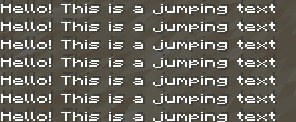
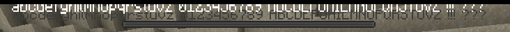
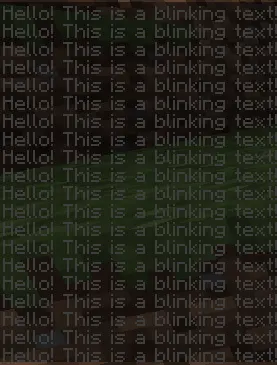
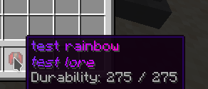

# 文本效果


* **需要 Minecraft 1.17+ 客户端**
* 不适用于 [Minecraft 语言文件](minecraft-language-files.md)（游戏限制）
* 编辑 `rendertype_text` 着色器文件


## 什么是文本效果？

它们是一些很酷的装饰性文本效果，可以在服务器中使用，使其更加专业。

## 如何启用


你需要运行 `/iazip` 以启用/禁用此功能。\
还要确保在 `config.yml` 中启用它。



```yaml
text_effects:
  enabled: true
  chat:
    enabled: true
  customitem_name_and_lore:
    enabled: true
  sign:
    enabled: true
  book:
    enabled: true
  anvil:
    enabled: true
```


<details>

<summary>(电极查看旧版 <code>config.yml</code>（4.0.7及以下）</summary>

```yaml
effects:
  text-effects:
    enabled: true # This option requires /iazip when changed.
    customitem-name-and-lore:
      enabled: true
    chat:
      enabled: true
    sign:
      enabled: true
    book:
      enabled: true
    anvil:
      enabled: true
```

</details>

你也需要将对应的权限给予玩家。

* 在 **聊天** 中使用 **文本效果**
  * `ia.user.text_effect.chat`
* 在 **标牌** 中使用 **文本效果**
  * `ia.user.text_effect.sign`
* 在 **书籍** 中使用 **文本效果**
  * `ia.user.text_effect.book`
* 在 **铁砧** 重命名中使用 **文本效果**
  * `ia.user.text_effect.anvil`
* 使用 **文本效果**
  * `ia.user.text_effect.use.<effect>`

## 效果列表

移除背景

<figure><figcaption></figcaption></figure>

权限: `ia.user.text_effect.use.noshadow`\
用法: `<noshadow text>`


#### Note

在Minecraft **1.21.4**中，你可以在 JSON 组件中使用 `"shadow_color":0` 属性来隐藏阴影。但这需要你具有 JSON 组件的相关知识。


### 彩虹


.png)

.png)


权限: `ia.user.text_effect.use.r`\
用法: `<r text>`

### 摇摆


权限: `ia.user.text_effect.use.w`\
用法: `<w text>`

### 跳跃






权限: `ia.user.text_effect.use.j`\
用法: `<j text>`

### 彩虹 + 摇摆


权限: `ia.user.text_effect.use.rw`\
用法: `<rw text>`

### 彩虹 + 跳跃


权限: `ia.user.text_effect.use.rj`\
用法: `<rj text>`

### 闪烁

<figure><figcaption></figcaption></figure>

权限: `ia.user.text_effect.use.b`\
用法: `<b text>`

## 这些效果可以在哪里使用？

* 自定义物品名称（在 .yml 文件中）
* 自定义物品描述（在 .yml 文件中）
* 聊天
* 告示牌
* 书
* Bossbar
* 前缀-后缀（例如 Luckperms）
* _更多（即将推出....）_



## 如何创建动画前缀（Luckperms）

.png)

`/lp group admin meta setprefix "<rw ADMIN >"`


如果你不知道前缀是如何工作的，点击这里阅读 [Luckperms 官方教程](https://luckperms.net/wiki/Prefixes,-Suffixes-&-Meta)。

## 在没有占位符的情况下使用文本效果

如果由于某些原因你想在不支持 ItemsAdder 占位符（如 `<r TEXT>`）的区域使用文本效果，你可以使用另一种方法。

这些效果是基于 **特殊的 HEX 颜色** 触发的。\
所以如果你想显示文本效果的区域支持 HEX 颜色，你可以这样做。

### 特殊颜色

#### 无阴影

`4e5c24`

#### 彩虹

`e6fffe`

#### 摇摆

`e6fffa`

#### 彩虹 + 摇摆

`e6fbfe`

#### 跳跃

`e6fbfa`

#### 彩虹 + 跳跃

`e6f7fe`

#### 闪烁

`e6f7fa`

### 在 Minecraft 原生 JSON 表示法中使用它们

这会触发彩虹效果：\
`/tellraw @a {"text":"custom text example", "color":"#e6fffe"}`

将 `e6fffe` 替换为你想要的效果。

### 在支持 _MiniMessage_ 的插件中使用它们



（例如 ItemsAdder 本身和 [ChatFormatter](https://www.spigotmc.org/resources/102212/)）

这会触发彩虹效果：`<#e6fffe>custom text example`

将 `e6fffe` 替换为你想要的效果。

### 在支持传统 HEX 表示法的插件中使用它们

#### 彩虹

`&X&E&6&F&F&F&E`\
等等。

这在 [EpicRename](https://www.spigotmc.org/resources/epicrename.4341/) 上测试过，应该可以在任何插件或 Spigot 使用其自己的传统颜色代码处理颜色替换的地方工作。

示例：`/rename &x&F&F&F&F&F&ETest`
