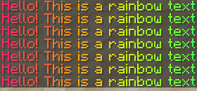
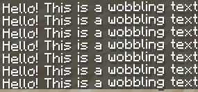
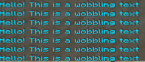
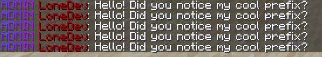

# 文字效果 (1.17+)

## 什么是文字效果？

在 ItemsAdder **2.4.19** 版本后，提供了一些非常炫酷的文字效果，使用这些效果可以使服务器显得更加高大上


## 该特性适用于 **Minecraft 1.17** 及以上客户端, 与服务端核心版本无联系



你必须先使用 `/iazip` 才能够 开启/关闭 该特性.\
并确保在 `config.yml`中启用该功能.
（如下）
```yaml
effects:
  text-effects:
    enabled: true
    replace-in-customitems-name-and-lore: true
    chat:
      enabled: true
    sign:
      enabled: true
    book:
      enabled: true
    anvil:
      enabled: true
```



## 效果

*  在 **聊天中** 使用 **文字效果**
  * `ia.user.text_effect.chat`
* 在 **告示牌中** 使用 **文字效果**
  * `ia.user.text_effect.sign`
* 在 **书中** 使用 **文字效果**
  * `ia.user.text_effect.book`
* 在 **铁砧中** 使用 **文字效果**
  * `ia.user.text_effect.anvil`
* 使用某种 **文字效果**
  * `ia.user.text_effect.use.<effect>`

## 效果列表

### Rainbow



.png>)

.png>)


效果: `ia.user.text_effect.use.r`\
用法: `<r 文本>`

### Wobble




效果: `ia.user.text_effect.use.w`\
用法: `<w 文本>`

### Jump


效果: `ia.user.text_effect.use.j`\
用法: `<j 文本>`

### Rainbow + Wobble


效果: `ia.user.text_effect.use.rw`\
用法: `<rw 文本>`

### Rainbow + Jump



效果: `ia.user.text_effect.use.rj`\
用法: `<rj 文本>`

## 文字效果使用范围

* 自定义物品的 名称 (在 .yml 中编辑)
* 自定义物拼的 lore (在 .yml 中编辑)
* 聊天
* 告示牌
* 书
* Bossbar
* 前缀&后缀 (例如Luckperms)
* _等等...._


## 如何创建动态文字前缀 (Luckperms)

.png>)

`/lp group admin meta setprefix "<rw ADMIN >"`



如果你不了解该插件 点击阅读[ Luckperms 官方指南](https://luckperms.net/wiki/Prefixes,-Suffixes-&-Meta) 
