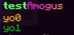
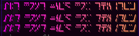

# Text Formatting


Doesn't work in [Minecraft language files](/broken/pages/-MT1a_gTKtJE5YCsGgBM) due to a Minecraft limitation.


## How to use colored texts

You can change color of text and specify a custom hex color using the special notation.

### Basic

`display_name: '&6TEST'`

```yml
items:
  custom_nbt_item_display_name_classic:
    enabled: true
    display_name: '&6TEST'
    resource:
      generate: false
      model_path: minecraft:item/emerald
      material: PAPER

```

### Minimessage





```yml
info:
  namespace: git_2224
  dictionary-lang: en
dictionary:
  display-name-test_gradient_dictionary: <b><color:#57ff5c>test</color></b><gradient:#ff00ee:#f79459>Amogus</gradient>
items:
  test_gradient_dictionary:
    display_name: display-name-test_gradient_dictionary
    lore:
      - "&6yo0"
      - "&2yo1"
    resource:
      generate: false
      model_path: minecraft:item/emerald
      material: PAPER
  test_font:
    display_name: <gradient:#ff00ee:#f79459><font:alt>Alt font used for this item</font></gradient>
    lore:
      - "<gradient:#ff00ee:#f79459><font:alt>Alt font used for this item</font></gradient>"
      - "<gradient:#ff00ee:#f79459><font:alt>Alt font used for this item</font></gradient>"
    resource:
      generate: false
      model_path: minecraft:item/emerald
      material: PAPER
```

```
<#FE5A00>Magic Fuel
<red>Magic <green>Fuel
<gradient:#ff00ee:#f79459>Here is a gradient example text!
```

<div><figure><figcaption></figcaption></figure> <figure><figcaption></figcaption></figure> <figure><figcaption></figcaption></figure></div>

<div><figure><figcaption></figcaption></figure> <figure><figcaption></figcaption></figure></div>

### Component



```yaml
items:  
  custom_nbt_item_display_name_component:
    display_name: '{"text\":"TEST", "font": "alt"}'
    resource:
      generate: false
      model_path: minecraft:item/emerald
      material: PAPER
```
